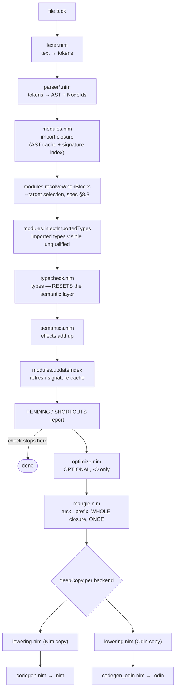

<!--
  Generated 2026-08-14, reflecting the tree at commit 59178bb (branch
  claude/spec-code-audit-34xh4q). Every claim here was read out of the source
  at that commit; file:line references will drift as the tree moves.

  Audience: an engineer working ON the compiler. For the LANGUAGE, read
  tuck-spec.md and LANGUAGE-OVERVIEW.md. For a from-first-principles tour of
  what a compiler is, read COMPILER-TOUR.md — this document assumes you
  already know and skips straight to what is specific to THIS one.
-->

# Working on the Tuck compiler

## 1. Orientation

Tuck is a systems language that transpiles to **Nim** and to **Odin**. The
compiler is a single Nim binary, `tuck`, built from `tuck.nim` plus `lexer.nim`
plus `compiler/*.nim` — about 18k lines. It reads a `.tuck` file, loads that
file's import closure, typechecks it, verifies its effect declarations, and
(for `compile`/`build`) emits source for exactly ONE target next to the
input — Nim by default, or `--odin`, or `--dlang` (mutually exclusive; two
targets need two invocations). `tuck build` additionally shells out to
`nim c` (or `odin build`, or `dmd`, matching whichever target was picked)
to link a binary. The entry point is `tuck.nim`; its header comment is the
pipeline in order, and `checkProgram` (`tuck.nim:252`) is the whole compiler
on one screen.

Commands: `lex`/`l`, `parse`/`p`, `check`/`ch`, `compile`/`c`, `build`/`b`,
`explain CODE`. Everything is fail-fast — the first error prints with
`file:line:col` and exits; there is no error recovery and no cascade.

## 2. The pipeline



| Stage | File | Job |
|---|---|---|
| lex | `lexer.nim` | text → tokens; raises `SyntaxError` |
| parse | `parser.nim`, `parser_expr.nim`, `parser_type.nim`, `parser_base.nim` | tokens → `Module`; ids assigned right after the parse |
| load | `modules.nim` | walk the import graph; two caches (below) |
| when-resolve | `modules.resolveWhenBlocks` | `--target` selects `when TARGET == "…"` blocks before checking |
| inject types | `modules.injectImportedTypes` | imported type decls become visible unqualified in the importer |
| typecheck | `typecheck*.nim` | the big one; §4 |
| effects | `semantics.nim` | a fn may only perform effects it declares |
| index | `modules.updateIndex` | write the signature index for the next run |
| optimize | `optimize.nim` | **off by default**, `-O:pass[,…]`; a no-op with no flag |
| mangle | `mangle.nim` | `tuck_` prefix on user names, so nothing collides with a backend keyword or a runtime proc |
| lower | `lowering.nim` | registry raises → plain calls; payload explosion → positional args |
| emit | `codegen.nim`, `codegen_odin.nim` | tree → target source text |

### Two caches (`modules.nim:24-55`)

1. **AST cache** `.tuck-cache/<name>.bin` — a msgpack'd `Module`, keyed on
   compiler build stamp + source hash. Skips lex+parse (~43% of compile time).
2. **Signature index** `.tuck-cache/index.bin` — the bigger win. Checking a
   module needs its imports' *signatures*, not their bodies, so `tuck check`
   never walks the interior of an imported module at all. `loadProgramIndexed`
   (check) vs `loadProgram` (compile, `needBodies = true`).

Both are best-effort: any stamp/hash mismatch or damage falls back to a fresh
parse. A cache that can serve a wrong answer is worse than no cache.

### The two ordering constraints

Both are documented in the source because both are easy to get wrong and
neither is visible from the code that depends on them.

**Typecheck before effects.** `typecheckProgram` calls `resetResolution()`
first thing (`typecheck.nim:3555`) — it owns the semantic layer's lifecycle.
Running `verifyModuleEffects` first would have its async call-site marks wiped
before codegen ever read them. Sequenced and commented in `checkOrDie`
(`tuck.nim:216-232`); also stated in `semantics.nim:21-29` and
`resolution.nim:113-117`.

**Each backend lowers its own `deepCopy`.** `lowerModule` and the emitters both
mutate the tree in place, so a shared tree means the second backend lowers
already-lowered code. `tuck.nim:362-365` (Nim) and `:383-386` (Odin). Node ids
survive the copy, so the `Resolution` built during checking stays reachable
from either clone.

Corollary, same place: **mangling runs once, whole-program, BEFORE the copies**
(`tuck.nim:347-357`). Whole-program because a qualified reference names a decl
in another module — `http::get` is a user fn and gets the prefix, `fs::readFile`
is an extern and does not — which one module alone cannot decide. Before the
copies because the `Resolution` is global; renaming per copy would leave the
other backend looking up names that no longer exist.

## 3. Data structures to understand before touching anything

### The AST — `compiler/ast.nim`

Three node families, all descending from `Node* = ref object of RootObj` which
carries `id: NodeId` and `span: Span`:

| Type | Variant field | Notes |
|---|---|---|
| `Type` | `TypeKind`: `tkNamed tkTuple tkApp tkFunc tkRecord tkSum tkUnion tkEffect tkRename` | `tkEffect` is the `!T`/`?T` wrapper |
| `Expr` | `ExprKind`, 24 kinds: `exkLit exkVar exkField exkQualified exkStruct exkList exkBracket exkBracketAssign exkCall exkChain exkBinary exkUnary exkBlock exkIf exkMatch exkFor exkWhile exkBreak exkContinue exkAssign exkReturn exkRaise exkImport exkSend exkSelect` | |
| `Decl` | `DeclKind`, 23 kinds: `dkType dkObject dkRegistry dkPool dkFn dkMixin dkExtern dkPending dkActor dkTask dkExpr dkConst dkRegister dkStaticAssert dkErrors dkImport dkSelect dkFnSig dkSatisfies dkInterface dkWhen` | each construct gets its OWN kind — `extern:`/`pending:` are not `dkMixin` with a magic name |

All three also carry `sourceName: Option[string]`. Mangling used to be
destructive and anything needing the original name guessed by stripping the
prefix; that broke error-id hashing and leaked `tuck_` into user-facing output.
`none` = never renamed (`name` IS the source name — the common case);
`some(s)` = renamed, `s` is what the user wrote (`ast.nim:5-23`).

**`iterator children*(e: Expr)`** (`ast.nim:707`) is the traversal for walks
that only VISIT. Its `case` is exhaustive on purpose: a new `ExprKind` must be
listed there or Nim refuses to compile, which is what stops a walk from
silently skipping a subtree and reporting clean. `clearIds` uses it; only
`assignIds`/`clearIds` hand-roll their own because they mutate. Note the one
thing `children` cannot yield: a `ChainStep` carries its own `id` and is not an
`Expr`, so `clearIds` handles chain steps separately (`ast.nim:777-781`).

### NodeId and the Resolution side-table — `compiler/resolution.nim`

**The AST stays a faithful record of syntax.** Everything the checker DERIVES
lives in a side-table keyed by `NodeId`, so a later pass may rewrite or clone
the tree without carrying or losing semantic residue — ids survive `deepCopy`,
so the lookups still resolve. That is "the semantic layer."

`NodeId = distinct uint32`, minted by `globalNodeCounter`. Assigned once right
after parsing, PROGRAM-wide (not per-module, because the tables span modules).
`0` means unassigned; `ensureId` mints one for a node the checker synthesized.

The `Resolution` object holds:

| Field | What the checker recorded |
|---|---|
| `calls` | sugar that turned out to be a call: `x.f`, bare nullary `f`, `xs[i]`, `xs[i] = v` |
| `types` | the inferred type of a node |
| `shortcuts` | errors-policy drop sites |
| `asyncCalls` | call sites whose callee is `[io]` — codegen awaits/yields them |
| `decls` / `declOf` | name resolution: id → declaration, and reference → declaration id |
| `argFields` / `callParams` | how a payload maps onto params, including by-TYPE matches lowering cannot re-derive |
| `wraps` / `ifacePairs` / `ifaceCalls` | interface wrapping, demand-driven (spec §5.3) |

There is **one global instance**, `semLayer`. Single-writer in two senses: in
PHASE (checker writes; lowering and both backends only read; `mangleProgram` is
the one exception and runs before the copies) and in THREAD (tuck is built
`--threads:off`). Parallel module checking would need this sharded per module
and merged at the join — and `ast.globalNodeCounter` breaks first, and silently
(`resolution.nim:108-133`).

### The checker-only sentinel type names — `ast.nim:330-359`

One `<unknown>` sentinel used to do several unrelated jobs, and because
`compatible` treats it as matching everything, each job silently disabled type
checking wherever its value flowed. Making it incompatible broke 15 checks, of
which only the generic ones were a real need — the rest were bugs it was
hiding. So it was split:

| Name | Const | Means |
|---|---|---|
| `<unknown>` | `UnknownName` | the checker could not tell. A GAP; the long-term goal is for this to be an error |
| `<typeparam>` | `TypeParamName` | a generic's `T` inside its own body: not unknown, ANY type, fixed per call site |
| `<pending>` | `PendingName` | declared, not implemented (spec §5.4); deliberately permissive so the walking skeleton runs |
| `<emptyrec>` | `EmptyRecName` | `{}` — a real type (the empty record), not the absence of one |
| `<afterror>` | `AfterErrorName` | a dummy returned after `fail()` already reported; nothing should ever check it |
| `<uninit>` | `UninitName` | a declared field the construction did not supply. Wraps the field's own type (`<uninit>[int]`) |

**They are spelled with angle brackets on purpose.** No user type can be named
`<unknown>` — the lexer will not produce that identifier — so a sentinel can
never collide with a real name, and if one ever escapes into a diagnostic or
emitted output it is unmistakable rather than plausible. Two more markers use
the same trick for the same reason: `ImportedTypeMarker = "<imported>"`
(`ast.nim:328`, a `span.file` value so codegen skips re-emitting an injected
type) and `satisfiesMark = "<satisfies>"` (`ast.nim:366`).

`<uninit>` in particular **rides in the TYPE**, wrapping the field's declared
type, so nesting cannot launder it. It is erased before codegen — the emitted
record keeps its declared field types exactly.

## 4. The type checker

The biggest module: `typecheck.nim` is 3,564 lines, split so it stays about
RULES rather than plumbing.

| File | Holds |
|---|---|
| `typecheck.nim` | the rules |
| `typecheck_state.nim` | `TypeChecker`, the scope stack, bind/lookup/resolve/fieldsOf |
| `typecheck_util.nim` | small shared predicates (`isWrapper`, `isUninit`, `fail`) |
| `typecheck_flow.nim` | pure pre-passes: transitions, callee scans, exits |
| `typecheck_conformance.nim` | `satisfies` — does this object meet the contract (§5.2) |
| `typecheck_pointers.nim` | where a raw pointer may and may not appear |
| `typecheck_decisions.nim` | decision-table coverage and overlap (§6.1) |
| `typecheck_transitions.nim` | validating a `transitions:` block's shape (§4.4) |

### The section map

`typecheck.nim`'s header carries its own map. Grep `# === ` to move between
sections, in file order: THE COMPATIBILITY RELATION · FIELD ACCESS · REGISTERS
/ MMIO · OPERATORS · BRANCHES, MATCH, THE MERGE · CHAINS AND MUTATION · CALL
SYNTHESIS · THE SPINE · SIGNATURE COLLECTION · CONST PURITY · PROGRAM DRIVER.

### Bidirectional checking

Two cooperating questions used in alternation:

- **synthesize** — "I have no expectations. What type IS this?" (`5` → `int`)
- **check** — "I expect a `str` here. Does this fit?"

Pure inference gets expensive and fragile; pure annotation gets tedious. The
shape is a single recursive walk: `synthesize()` descends, each node combines
its children's types into its own, one pass types the whole tree. No fixpoint
iteration, no constraint solver, no unification queue, and — because errors
raise immediately — no error-recovery machinery. That is why a checker doing
this much work is still roughly a quarter of total compile time.

**Gradual by design.** An undeclared symbol synthesizes `<unknown>`, which is
compatible with everything, so half-written sketch code still compiles while
declared parts are checked strictly. This is what makes `pending:` blocks work.
It is also why a parser bug can look like sketch code — see the note in the
memory file about dumping `--ast` first.

**The indexes that make it fast.** Before walking anything, `fnSigs` (name →
params/return/generics/effects) and `typeDecls` (name → declared body) are
built once per module as hash tables, so name resolution during the walk is
O(1). Reaching for `ast_query`'s `findDecl`/`findFn` per node instead is a
linear scan of the decl list, making the pass O(N²). Some paths still do it,
and it shows: 8× input grows this pass 14.4× against lexing's 8.9×.

### The four implicit proc-family contracts

The naming convention is load-bearing — the return type tells you the contract.

| Prefix | Returns | Contract | Example |
|---|---|---|---|
| `synth*` | `Type` | always produces a type; this node's type IS this | `synthBinary` `:895`, `synthCall` `:1813` |
| `as*` | `Type` or **nil** | "not mine" — nil means try the next interpretation | `asPlainField` `:493`, `asInterfaceCall` `:510` |
| `failIf*` | nothing | raises `SemanticError` on violation, returns otherwise | `failIfUnhandled` `:823`, `failIfMutatingLet` `:1100` |
| `check*` | nothing (or a type) | validates against an EXPECTATION already in hand | `check` `:1233`, `checkCallArgs` `:1556` |

An `as*` proc that raises rather than returning nil is a deliberate choice and
means "this IS mine, and it is wrong" — `asPlainField` does exactly that for a
field/fn name clash and for a `<uninit>` read.

### Ordered dispatch: the order IS the language rule

`a.b` means several different things in Tuck, and the checker decides which by
trying them in a fixed order. `synthFieldAccess` (`:783`) splits into two
groups — what the syntax alone can settle, then what needs the receiver's type:

`syntacticFieldForm` (`:665`), first non-nil wins:
1. `asResultIntrospection` — `.ok`/`.err`/`.value` on a fallible value
2. `asSlotInvoke` — `slot.invoke {args}` through a baked slot
3. `asPostfixApplication` — `5.ms`, `n.toStr`, EARLY (literal/var receiver)
4. `asVariantConstruction` — `Color.Red`

`typedFieldForm` (`:673`):
5. `asPlainField` — an ordinary field read
6. `asStaticMemberCall` — `Pool.acquire`
7. `asInterfaceCall` — resolve against the CONTRACT
8. `asFnByName` — postfix application, FALLTHROUGH, plus `.fn {args}`

**Change the order and you change what programs mean.** 3 and 8 are the same
operation reached from two points: 3 must precede variant construction and
field reads so `5.ms` is not read as a field; 8 must follow them so a real
field wins over a same-named fn. `asPlainField` sits between and *fails* on a
field/fn clash, which is what makes the split safe. Within
`typedFieldForm`, `asInterfaceCall` must precede `asFnByName` — the latter
looks the bare name up in the flat signature table and would find whichever
object declared one, rejecting the receiver or silently picking the wrong
object's member.

`Pool.acquire` is NOT `module::function`. That is `exkQualified`, resolved in
`synthCall` via `calleeNameOf`, and never reaches here. Both namespaces live in
`fnSigs`: `.` for pool members, `::` for module calls.

## 5. Per-variable analysis state

What the checker knows about a variable, and where each piece lives:

| State | Home | Keyed by |
|---|---|---|
| type, `isVar`, `isParam` | `Binding` in the scope stack | binding (scope-correct) |
| `narrowed` — "this result was guarded, `.value` is readable" (§4.8) | `Binding.narrowed`; `setNarrowed`/`isNarrowed` walk exactly as `lookup` does | binding (scope-correct) |
| `<uninit>` — a field the construction skipped | rides IN the binding's record TYPE; `retype`/`clearUninit` rebuild it | binding (scope-correct) |
| `varVariants` — per-var possible-variant set for transition types (§4.4b) | `Table[string, seq[string]]` + `shadowedVariants` undo log, one frame per scope | **bare name** |
| `varErrTypes` — result var → the `[error: …]` enums of the fn that produced it | `Table[string, seq[string]]` | **bare name** |
| `currentErrTypes`, `loopDepth`, `errPolicy`, `transitionCtx`, … | flat fields on `TypeChecker` | per-fn / per-checker |

**The hazard: several of these are keyed by bare variable name.** Two bindings
can share a spelling, and a name-keyed table cannot tell them apart. That has
shipped twice, in both directions:

- **`711b77b`** — narrowing was a `HashSet[string]` beside the scope stack. An
  inner `let r` inherited the outer `r`'s narrowing and read `.value` off an
  unhandled wrapper: **invalid code ACCEPTED**, defeating the one rule the guard
  exists to enforce. Fixed by moving narrowing onto `Binding`, where the scope
  stack already does the work. `synthBlock` unwinds BEFORE `popScope`, because a
  block's guard often marks a binding from an enclosing scope.
- **`f02f8f6`** — the mirror image, same root cause, opposite symptom.
  `varVariants` is name-keyed, so an inner `var s` overwrote the outer's entry;
  that state outlived its scope and merged into the outer at the branch join,
  widening `{Running}` to `{Idle|Running}` and **REJECTING a declared, legal
  transition** — with a message naming a state the variable was never in. Fixed
  at the scope level instead of moving to `Binding`: the table is merged
  wholesale at three join sites (`mergeVariants`), and walking the scope stack
  there would be a much larger change at exactly the places merge bugs live.
  `bindName` now records what a name's state was before it shadowed an outer
  one; `popScope` puts it back. Only names a scope actually REBOUND are touched,
  which is what keeps branch merging working. `had` distinguishes "no outer
  entry" from "empty outer entry" (`typecheck_state.nim:88-125`).

**The lesson, both times:** the scope stack already encodes shadowing; anything
keyed beside it by bare name has to re-derive that, and gets it wrong. Prefer
`Binding`. Where a real join makes that expensive (variant sets), extend
`popScope`'s undo log instead — and when you add per-variable state, write the
shadowed-name test *first*: the correct unshadowed case passes either way.
`varErrTypes` is still name-keyed and has no undo log today.

## 6. The backends

`codegen.nim` (Nim, 1,940 lines) and `codegen_odin.nim` (Odin, 2,492) are
twins. By the time code reaches either, every hard question is answered — types
check, effects add up, names cannot collide, fancy constructs are lowered away.
What is left is transcription.

`genExpr`/`genDecl` are each one big `case` over node kinds, and are
deliberately NOT split: Nim errors on a `case` that misses an enum value, so
adding an `ExprKind` immediately names every backend that has not handled it.
Break the dispatch up and that error becomes a silent gap that ships. The rule:
**length is not the problem, nesting is** — the dispatch stays whole and the
arms delegate to small named procs.

**Shared** (`codegen_common.nim`): logic with nothing to do with the target —
`errNameFor`, `actorSingletonName`, `lookupFnParams`. `codegen_table.nim`
(decision-table combinatorics, §6.1) is shared too.
**Not shared, on purpose**: anything whose difference IS the target syntax.
`genObjectDecl` exists in both because Nim spells it `type X = object` and Odin
spells it `X :: struct {}`. Share the logic; never share the syntax.

What Odin makes harder (each is a real branch in `codegen_odin.nim`):

| Odin lacks | Consequence |
|---|---|
| unqualified import / re-export | every `impl:` module and the runtime get a local forwarder so call sites stay unqualified (`:49`, `:2084`) |
| an anonymous record/struct type | record shapes are hoisted to named structs keyed by shape signature; a bare `{a = 1}` with no resolvable shape is a hard error (`:404`, `:423`) |
| overloading | member fns are type-qualified names (`:312`, `:1513`, `:1634`) |
| methods | an actor rides as a `self` pointer plus field prefix (`:1719`) |
| a switch EXPRESSION | value-position match becomes a statement form; value-position `if` becomes the ternary (`:902`, `:1099`) |
| module-global enum scope | bare enum tags are qualified with their declared owner (`:890`) |
| a C compiler | `lib: "x.c"` is compiled to an object by the driver and linked, where Nim takes the `.c` via `{.compile.}` (`tuck.nim:416-430`) |
| single-file packages | an imported module becomes `mod_<name>/<name>.odin`, a directory (`tuck.nim:391-398`) |

**Emitted output for `examples/` is checked in on purpose.** `examples/NN-*.nim`
and `examples/NN-*.odin` sit in git beside their `.tuck` source, so a codegen
change shows up as a reviewable diff in the PR rather than as a silent
behaviour change. Regenerate with `tools/emit_examples.sh`. The same idea at
snippet scale is `tests/golden/<suite>/*.nim`, driven by `t.frozen`.

## 7. Build and test

```sh
nim c --hints:off -o:tuck tuck.nim   # build the compiler by hand (rarely needed)
./tests/run                          # everything
./tests/run typecheck uninit         # named suites
./tests/run --check                  # the edit loop
./tests/run --bless                  # rewrite goldens
./tests/run --jobs:N                 # override the pool bound
TUCK_REQUIRE_ODIN=1 ./tests/run      # fail, don't skip, when odin is absent
./run-all-tests.sh                   # the pre-commit gate (a wrapper over tests/run)
```

`tests/run` is a **shell script**, not the compiled runner. It rebuilds
`tests/.runner-bin` only when `tests/runner.nim`, `tests/harness.nim` or
`tests/suites/*.nim` is newer, then execs it. It used to be the binary itself,
which made a stale build indistinguishable from a fresh one — editing a suite
re-ran the PREVIOUS version and reported green. That cost a wrong commit on
2026-08-13. The runner then rebuilds `tuck` itself at stage 1, also only when
stale (`tuck.nim`, `lexer.nim`, `compiler/*.nim`), so the compiler under test is
always current without paying Nim's ~2.95s "nothing changed" check every run.

### Tests drive the BINARY

Nothing imports the compiler as a Nim library. The old `tests/*.nim` each did
`import ../compiler/codegen`, so `nim c` re-ran semantic analysis over the whole
compiler once per test file — ten builds of the compiler to run nine tests. Now
`nim` is invoked exactly once for the whole suite, and every assertion shells
out to `./tuck`.

Every subprocess goes into **one flat pool** bounded by the core count. The
predecessor bash suite had two nesting levels of parallelism that could not see
each other, and 21 scripts × 2 jobs on 6 cores measured a 3.2× contention tax.

### The three modes: filtered by VERB, not by suite

The clock is decided by one question: does an assertion invoke a *backend*
compiler? `tuck` is milliseconds; `nim c`/`odin build` on the emitted code is
~1s. So the modes cap `harness.maxVerb` and **every suite runs in every mode** —
assertions above the cap report SKIP and are counted.

| Mode | `maxVerb` | Covers | Wall |
|---|---|---|---|
| `--check` | `vCheck` | types, effects, diagnostics | ~2s |
| `--quick` | `vEmitOdin` | + `tuck c`: `emits`/`omits`/`frozen` goldens | ~5s |
| default (`--full`) | `vRun` | + `nim` build & run: exit codes and stdout | ~30s |

This replaced a SUITE-level `--quick`, which excluded whole files and so
classified `declarations` — 27 `badCheck`s, zero runs, ~2ms each — as slow.

Odin builds additionally need `TUCK_REQUIRE_ODIN=1` or they skip when the
toolchain is absent (`tests/suites/odin_backend.nim:99`). Set it in CI, or an
entire backend can go unverified while the suite reports green.

### The harness DSL — `tests/harness.nim`

A suite is a `proc run*(t: var T)` and runs **twice**: once to REGISTER work
(`pCollect`), once to REPORT on it (`pReport`). The runner executes everything
in between. Call sites look identical in both passes; `t.phase` is what differs.

```nim
t.src """
fn main() -> int:
  return 0
"""
t.okCheck "a trivial program checks"
t.badCheck "a composed collision", "TK-TY05"   # pattern is a regex over stderr
t.runs "it exits 0", 0
t.outputs "it greets", "hello"
t.emits "the div is integer", "div"            # greps the emitted Nim
t.omitsOdin "no leftover marker", "<uninit>"
t.frozen "integer division"                     # byte-compare tests/golden/<suite>/
```

Each `t.src` gets its own scratch dir, so a stale artifact from a previous case
can never satisfy this one. Repeated assertions against one snippet reuse the
same work item (`byKey` dedup) — `mangle` greps one emitted program 19 times.

**The known-bug tri-state.** A bug entry states the CORRECT behaviour as a real
assertion plus whether the compiler does that yet:

```nim
t.quietly: t.runs("x", 2)
t.bugOpen "x"     # expected to fail. If it PASSES, the suite fails and tells
                  # you to flip it to bugFixed — which is how a fix gets locked in.
t.bugFixed "x"    # must hold. If it breaks, it REGRESSED.
```

Nothing is ever deleted, so a bug that returns is caught by the test written
when it was first found. A skipped assertion is not evidence in either direction
and reports SKIP through both.

**`frozen` deserves a word.** It asserts the emitted Nim is byte-for-byte what
it was when the behaviour was last verified BY HAND — no compiling, no running.
It replaced `runs` for cases whose point is a runtime fact (`/i` really doing
integer division shows up as `a = (a div 4)`); 40 of them were 41s of a 69s
suite. **When the diff appears, read it.** If the new text is better, verify the
runtime behaviour by hand ONCE, then `--bless`. A diff nobody can justify is the
regression this exists to catch.

### Adding a suite

Write `tests/suites/<name>.nim` exporting `proc run*(t: var T)`, then
`python3 tests/suites/regen.py`. The registry `all.nim` is pure bookkeeping —
one import and one row per suite — so it is derived, never hand-edited. Add the
name to `QUICK` in `regen.py` if the suite is check-only.

## 8. The quality gates

### Cyclomatic complexity ratchet — `tests/suites/complexity.nim`, `tools/cc.nim`

Measured on the **real Nim AST**, not a regex: `tools/cc.nim` parses each file
with the Nim compiler's own parser and walks the tree. The predecessor matched
`if|elif|while|and|or|except` as text, which overcounted words inside string
literals (a three-arm `case` whose arms were English sentences scored 8) and
never counted `case` arms at all (a 20-arm dispatch scored 1).

Three numbers, all **ratchets** — set to whatever the tree currently is, lowered
by hand as procs are split, **never raised to accommodate new code**:

| Gate | Means |
|---|---|
| `CEILING` | no proc may exceed this complexity |
| `DEBT` | sum of `(cc - 5)` over every proc above 5 |
| `HEAVY` | how many procs may sit at `cc >= 15` |

The live values are the `const` block at the top of
`tests/suites/complexity.nim` — read them there rather than from here; they
ratchet down as the tree improves and any number quoted in prose goes stale.
Run `./tools/cc --gate 64 --debt N --heavy N compiler/*.nim lexer.nim tuck.nim`
to see the current figures and the ranked worst offenders.

DEBT and HEAVY replaced a plain COUNT of procs over 5, which weighted a cc=6
helper the same as a cc=53 monster — so it fired on the 64 procs sitting one
over the line while staying silent about the tail, and it PUNISHED the fix
(splitting cc=53 into three readable procs *raised* the count by two). DEBT
makes the arithmetic match the intent: 53 → 8+7+6 moves debt 48 → 6.

**Raising either number requires a written reason in the const block** in
`complexity.nim` — the existing entries are the model, each naming what was
extracted first and what irreducible rule the remainder is.

**Dispatch arms are exempt, and the exemption is earned.** An `of` arm whose
body contains zero branch points is a lookup-table entry written in
control-flow syntax; charging one apiece made a 21-kind AST dispatch outscore
genuinely knotty code, taxing exactly the shape this tree wants (`ast.children`,
`clearIds`). Measured by recursing into the arm — anything that loops, tests, or
short-circuits still counts in full (`tools/cc.nim isDispatchArm`). Turning this
on moved the honest debt 1964 → 1476 with no code change.

`tools/cc` prints "tighten --debt/--heavy to N" whenever the real figure is
below the gate, so slack reports itself. Build it once (it imports Nim's
compiler sources, so it needs the install root on the path):

```sh
nim c --path:$(dirname $(dirname $(readlink -f $(command -v nim)))) \
    -o:tools/cc tools/cc.nim
tools/cc compiler/*.nim lexer.nim tuck.nim | head -20   # the ranked table
```

### Every diagnostic code needs an `explain` body

`tests/suites/diagnostics.nim` greps `compiler/diagnostics.nim` for every
declared `dcFoo = "TK-XX01"`, shells `./tuck explain <code>` for each, and
**fails if any answers "no such diagnostic" or "No code assigned"**. It also
asserts an unknown code is rejected and that the short form (`tuck explain
ty05`) resolves.

Codes are `TK-` + a two-letter CATEGORY + a number: `LX PA TY CO DE ST TR CN EF
PE PO SE SM AC ME IV RG RE`. **Numbers are permanent** — a deleted diagnostic
RETIRES its number, never reuses it, because a user who searched TK-TY41 last
year must not land on an unrelated rule today. Add new codes at the END of their
category's block.

## 9. Conventions

- **Exhaustive `case`, no `else`.** Nim errors on a `case` missing an enum
  value; `else: discard` throws that away and hides the kind you forgot. This is
  why `children`, `clearIds`, `genExpr` and `genDecl` all list every arm. It is
  also why a bug once made an entire `on select` handler body vanish silently
  (`ast.nim:168-184`) — the fix was `SelectSourceKind`, an enum, so an
  unlowerable shape is a branch someone must WRITE.
- **Named enums, never magic ints or bare-string compares.** Same reason.
- **Comments explain WHY.** This codebase is unusually heavily commented and it
  is deliberate — most headers explain a decision, its alternatives, and the bug
  that motivated it, often with the measurement. When you change behaviour the
  comment justifying the old one is part of the diff. When you discover a hidden
  inter-pass dependency, write it down *where the ordering is decided*
  (`semantics.nim:21-29` is the model).
- **Golden/frozen outputs.** `tests/golden/` for snippets, checked-in
  `examples/*.nim` and `*.odin` for the corpus. Both make a codegen change a
  diff.
- **Fail fast, one real error.** Diagnostics raise `SemanticError` and stop.
  Don't add error recovery locally.
- **`compatible` is the chokepoint.** Every call site, assignment and return
  routes through it, so a change there changes what the whole language accepts.
- **Prefer the table to the scan.** `fnSigs`/`typeDecls`/`Resolution.decls`
  exist because `findDecl`-per-node is O(N²). Several `isXType`-style helpers in
  the backends build a one-shot `HashSet` on first call for the same reason
  (`codegen_odin.nim:59-79`).

## 10. Your first change

Pick a diagnostic, sharpen it, prove it. Roughly 15 minutes.

1. **Find one.** `./tuck explain TK-TY16` prints the rule; `compiler/diagnostics.nim`
   is the registry. Pick a code whose message you think could say more.
2. **Find where it fires.** `grep -n dcTyUninitRead compiler/*.nim` — the enum
   name, not the string. Diagnostics are raised through `fail(...)` in
   `typecheck_util.nim`.
3. **Reproduce it.** Write the smallest `.tuck` that trips it and run
   `./tuck ch /tmp/x.tuck`. Confirm the code appears in the output — this is
   step zero of the never-guess rule; a rejection may already be correct and the
   defect only the message.
4. **Write the test first.** Add to the suite that owns the rule (or a new
   `tests/suites/<name>.nim` + `python3 tests/suites/regen.py`):
   ```nim
   t.src """<your snippet>"""
   t.badCheck "reading a skipped field names the field", "TK-TY16.*fieldname"
   ```
5. **Run just it:** `./tests/run <suite> --check`. Watch it fail.
6. **Change the message.** Keep the code; codes are permanent.
7. **`./tests/run <suite> --check`** — green. Then `./run-all-tests.sh` before
   committing: the complexity ratchet and the `explain`-coverage suite both live
   there and both will tell you if a guard clause you added pushed DEBT over.

Adding a *new* diagnostic instead? Add the enum arm at the END of its category
block, give it an `explain` body in the same file (the diagnostics suite fails
otherwise), raise it from the rule, and add a `badCheck`. Explanations are
grouped `case` tables reached through `explanationOf` → `typeExplanation` →
`valueFitExplanation` and friends, so an arm in an existing table is a pure
dispatch arm and costs nothing; only a genuinely new decision does. Run
`tools/cc` if the ratchet complains and put the reason in `complexity.nim`.

---

**Further reading:** [COMPILER-TOUR.md](COMPILER-TOUR.md) (what a compiler is,
using this one as the example), [tuck-spec.md](tuck-spec.md) (what the language
IS), [LANGUAGE-OVERVIEW.md](LANGUAGE-OVERVIEW.md) §0 (what will surprise you —
read this before deciding a feature is a bug),
[MISSING-FEATURES.md](MISSING-FEATURES.md) (open gaps). If a document and the
compiler disagree, the compiler is right.
