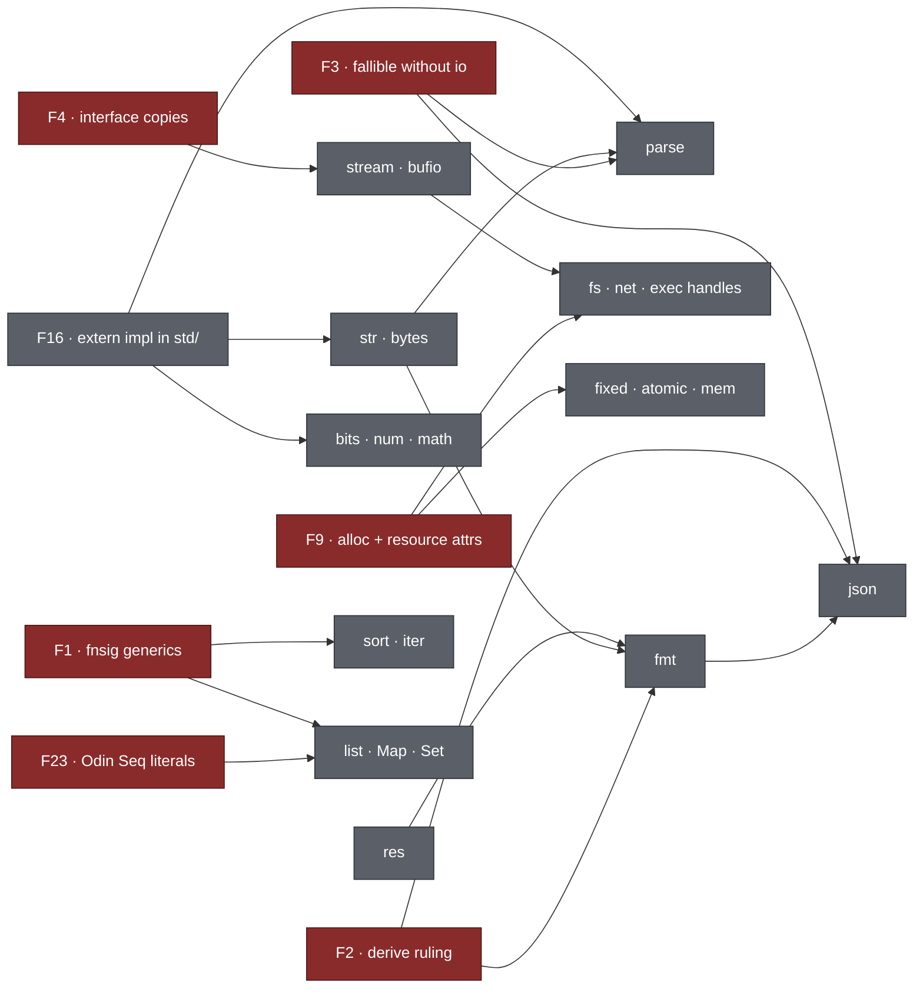
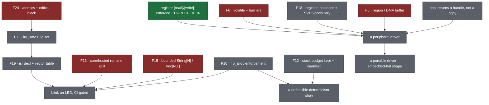
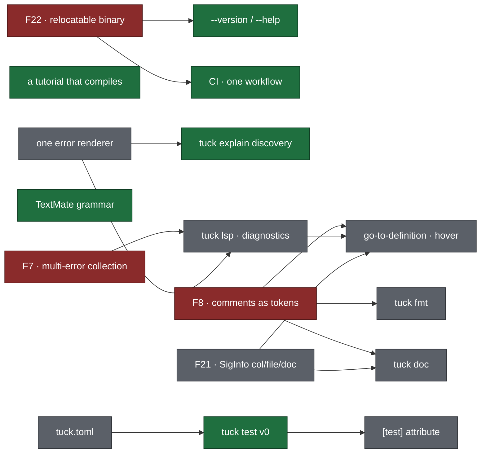

# Tuck 1.0: the dependency graph

Status: planning report, 2026-08-19. Companion to three documents that already
exist and are **not** repeated here:

| Document | What it is |
|---|---|
| `/home/kl/.claude/plans/lucky-coalescing-cocke.md` | the **milestone** roadmap 0.4 → 1.0, the decisions table, the hole mechanism |
| `stdlib-blocks.md` | the layer-0 **catalogue**: 78 signature rows classified by implementation cost |
| `stdlib-layers.md` | the **layer map** L0 → L5, and how Go / .NET / Rust / BEAM stack theirs |
| `ROADMAP.md` | the **decision log**, Done / Partial / Missing |

This document is the missing artifact: the **graph**. The milestone list asserts
an order; the graph derives it. Every edge answers one question — *what does
this gate?* — so the release sequence is a topological sort rather than a
judgement call.

---

## 0. How to read this

**Three tiers.**

1. **Foundations** (`F*`) — compiler rulings and mechanisms. Not features a user
   asks for; things a feature cannot exist without.
2. **Stdlib & runtime** (`S*`) — modules and runtime capabilities.
3. **Capabilities** (`C*`) — what a person can actually build. "Blink an LED",
   "write a web service", "bind a vendor HAL".

**An edge means "gates".** `F1 --> S.sort` reads *"`fnsig` generics gate the
sort module"*. Nothing is drawn because it is thematically related; only because
the target cannot be finished until the source is ruled.

**Status glyphs**, used consistently in every table:

| Glyph | Meaning |
|---|---|
| ✅ | built **and** connected — reachable from user code, covered by a suite |
| ◐ | built, **not connected** — the mechanism exists and nothing reaches it |
| ✗ | absent |
| ⛔ | **structurally blocked** — a current ruling forbids it; needs a decision, not code |

The `◐` column is the whole story of this project. Two audits (2026-08-15) found
that most gaps are declared-but-not-connected, not missing. The graph makes that
visible as a shape: a dense foundation tier with edges that stop halfway.

**Every unfilled node is a hole with a test.** See §11 — the `holeOpen` /
`holeFilled` mechanism from the milestone plan is what makes this graph
machine-checked rather than prose.

**The scoping rule, applied to every node in this document.**

> Would someone reach for Tuck with a **game jam** in front of them — two days,
> indie, one person? They will not implement a hash map from scratch. They will
> also not tolerate a language that takes a day to set up.

That single test decides more scope questions than any layer map, and it cuts in
both directions:

- **It promotes:** `Map` / `Set` / `sort` / `str` / `fmt` / `json` / `rand` /
  `time` / file read-write / `tuck run` / a working install. A jam dev writes
  *game logic*, not containers. Any of these missing and the answer is "no".
- **It demotes:** TLS, HTTP servers, a package registry, crypto suites, regex,
  supervision trees, a doc generator. Nothing in a two-day project needs them,
  and each one is months.
- **It refuses bloat by construction:** if a module is not on the path to
  shipping a small thing in two days, it is not 1.0 scope. It goes to the
  ecosystem or to 1.1.

The consequence for the graph is concrete and appears in §4, §6 and §10:
**`F1` (`fnsig` generics) stops being a "decide later" ruling and becomes a 1.0
gate**, because it is the only thing standing between a jam dev and a hash map.
See §10 for the lens in full.

**The second rule, applied to every borrow in §5: value, not architecture.**

> Tuck evades complexity. For each capability, ask **what final value the module
> actually gives the user**, then take the most pragmatic and simple path to
> that value — which is often a *different architecture*, not a smaller copy of
> the reference one.

The canonical illustration, and the one to reason by:

> **A SQL server can be a behemoth, so take the SQLite path** — local,
> lightweight, fast enough, file-based, and inspectable, which is to say
> *transparent*. A web server can be huge; find the lightest thing that works
> well and build that.

This is the difference between "port Go's `io`" and "get what Go's `io` gives
you". SQLite is not a small SQL Server — it is a different shape that delivers
the value most programs actually wanted, at a fraction of the cost, and it wins
on a property the big one doesn't even offer: you can open the file and look.
Four consequences that bind the later sections:

- **Name the value, then choose the shape.** Not *"how does .NET implement
  this"* but *"what does a person get from this module, and what is the
  simplest thing that gets them there"*. Worked through in §5.1.
- **Transparency counts as value.** File-based and inspectable beats opaque and
  clever. It is also what makes a two-day user trust the thing.
- **A smaller mechanism covering the same ground wins.** Zig's
  `packed struct(u32)` is *"genuinely better than svd2rust's closure API and
  about a tenth the machinery"* — that ratio is the standard, not an anecdote.
- **When Tuck's own machinery already covers a borrowed idea, use it.**
  `[test]` is one `elif` in an existing attribute vocabulary; a `dkTest` node
  would cost every backend a dispatch arm for zero gain. `interface`+`satisfies`
  is already the shape of `embedded-hal`.

**Actors are the load-bearing instance of this rule, not merely a feature.** The
reason a lot of complex software becomes tractable in Tuck is that the actor
model replaces a pile of mechanisms — threads, locks, condition variables,
futures, callback graphs — with **one mental model** the user already holds
after five minutes. That is exactly "the most pragmatic path to the value":
concurrency's value is *do many things at once without corrupting state*, and
one model that delivers it beats four that compose badly. See §8 for what that
costs today and what it needs.

Where the two rules disagree, they usually don't: the jam test says *what must
be in the box*, this one says *how big the box is allowed to get, and in what
shape*.

**The third rule, and it governs the compiler rather than the library: reject,
don't transform.**

> Most of the compiler **rejects faults and lets good code proceed**. A few real
> transformations exist — `[saturating]`, `[wrapping]`, the effect lowerings —
> and they are deliberately local. This is how Tuck avoids writing complicated
> compiler passes.

Visible in the tree, not just stated: `[saturating]` is resolved by a
name→type lookup consulted *during emission* (`codegen.nim:94-99`), not by an
AST-rewriting pass; `optimize.nim` holds the only rewriting passes and they are
**off unless `-O` names them**. The checker's own taxonomy says the same thing —
`check*` asserts, `fail*` raises, `synth*` returns a type — with `as*` returning
nil for "not mine".

This is a scoping rule for the foundation tier, and it sorts the nodes cleanly:

| Node | Under this rule |
|---|---|
| `F10` `[no_alloc]`, `F11` `[irq_safe]`, `F26` unknown-name reporting, `F7` multi-error | **rejectors.** Walk, compare, say no. All cheap, all in the grain |
| `F12` `[stack: N]` | already the rule applied — the compiler *emits a manifest* and a post-link tool does the analysis. Any frame size the front end computed would be fiction anyway |
| `F6` volatile, `F19` vector table | **emission**, mechanical: choose `volatileLoad` over a deref, print a table from a declaration set |
| `F2` **derive** | **the one true transformation on the list**, and therefore the one to be most suspicious of. The stdlib inventory already recommends *don't derive — hand-write, measure, revisit*. This rule says the same thing for an independent reason, which is the strongest argument available for Q7 |
| `F1` `fnsig` generics | substitution the compiler already does for generics (Appendix A.1). Extending it is not a new pass |

**The payoff to state out loud:** a compiler that mostly rejects is a compiler a
small team can keep correct — and it is why the diagnostic registry, the
decision-table completeness proof and the register bit-overlap check exist at
all. They are rejections, which is what this compiler is good at.

**Evidence.** Every claim below carries a `file:line`. Where an assertion could
not be reproduced against the current tree, it says so. The compiler beats every
document, this one included.

---

## 1. Birdseye

The coarse graph. Detail per lens in §6–§9.

```mermaid
flowchart TB
  classDef built fill:#1f6f3f,stroke:#0d3b21,color:#fff
  classDef partial fill:#8a6d1f,stroke:#4d3c0f,color:#fff
  classDef absent fill:#5b6068,stroke:#2f3237,color:#fff
  classDef blocked fill:#8a2b2b,stroke:#4d1616,color:#fff

  subgraph FOUND["TIER 1 — language foundations"]
    direction TB
    F5["F5 · pointer / region rule"]:::blocked
    F1["F1 · fnsig generics"]:::absent
    F2["F2 · derive ruling"]:::absent
    F3["F3 · fallible without [io]"]:::blocked
    F4["F4 · interface dispatch copies"]:::blocked
    F6["F6 · volatile + barriers"]:::absent
    F10["F10 · no_alloc enforcement"]:::absent
    F13["F13 · core / hosted runtime split"]:::absent
    F14["F14 · reply address"]:::absent
    F20["F20 · mailbox drop policy"]:::partial
    F7["F7 · multi-error collection"]:::absent
    F22["F22 · relocatable binary"]:::absent
    F17["F17 · bake actually runs"]:::partial
  end

  subgraph STD["TIER 2 — stdlib & runtime"]
    direction TB
    Score["core tier · res bits num math fixed atomic mem hash"]:::absent
    Salloc["alloc tier · str bytes list fmt parse sort json"]:::absent
    Shosted["hosted tier · fs sys net time exec log test"]:::partial
    Sstream["stream · reader / writer keystone"]:::absent
    Sactor["actor runtime · mailbox, select, scheduler"]:::partial
    Smmio["MMIO / registers"]:::partial
    Sbare["freestanding profile"]:::absent
  end

  subgraph CAP["TIER 3 — what you can build"]
    direction TB
    C11["C11 · a small project in a weekend — the acceptance test"]:::absent
    C1["C1 · a CLI tool"]:::absent
    C2["C2 · a network service"]:::absent
    C3["C3 · an actor system"]:::partial
    C4["C4 · a hosted driver / OS component"]:::blocked
    C5["C5 · firmware that blinks an LED"]:::absent
    C7["C7 · tests for your own code"]:::absent
    C8["C8 · an editor that understands Tuck"]:::absent
    C9["C9 · a binding to a C library"]:::partial
  end

  F1 --> Salloc
  F2 --> Salloc
  F3 --> Salloc
  F17 --> Salloc
  F4 --> Sstream
  Sstream --> Shosted
  Score --> Salloc
  Salloc --> C11
  F1 --> C11
  F22 --> C11
  Salloc --> C1
  Sstream --> C2
  Shosted --> C1
  Shosted --> C2
  F14 --> Sactor
  F20 --> Sactor
  Sactor --> C3
  F5 --> C4
  F5 --> C9
  F6 --> Smmio
  Smmio --> C4
  Smmio --> C5
  F10 --> Sbare
  F13 --> Sbare
  Sbare --> C5
  F7 --> C8
  F22 --> C1
  F22 --> C5
```

Read three things off it immediately:

- **`F5` (the pointer rule) is the only foundation node with edges into two
  different capability families** — hosted drivers *and* C bindings. It is the
  deepest tension in the positioning, and §7 gives it its own section.
- **The stdlib's alloc tier has four inbound foundation edges** (`F1`, `F2`,
  `F3`, `F17`). That is why "just write the stdlib" has never started: four
  unmade rulings sit above it.
- **`C5` (metal) depends on nothing the hosted path needs.** The embedded story
  is a *parallel* branch, not a later one — which is what makes "Odin is the
  bare-metal backend, Nim is the hosted one" a coherent call rather than a
  retreat (§7).

---

## 2. Tier 1 — the foundation nodes

Each row: what the ruling is, its status, the evidence, and **what it gates**.
This table is the spine of the document; §3 and §4 hang off it.

| # | Foundation | Status | Evidence | Gates |
|---|---|---|---|---|
| **F1** | `fnsig` takes generic params; generics take constraints | ✗ | `parser.nim:464` has no generic slot; Appendix A.1 — substitution, no constraints | `sort`, `iter`, `list` adapters, `Map`/`Set`/`Deque`, every higher-order stdlib fn |
| **F2** | derive-style codegen for records (hash / eq / ord / toStr) | ✗ | no reflection, no macros; `stdlib-layers.md` L1 note | `fmt`, `json`, `Map` keyed by a record — *one decision, three payoffs* |
| **F3** | `[error: E]` permitted without `[io]` | ⛔ | `typecheck.nim:2686` `checkFallibleNeedsIo` | every pure parser: `parse`, `json`, `num`. Today a JSON decoder poisons its whole call graph with `[io]` |
| **F4** | interface dispatch without copying the receiver | ⛔ | interfaces are copying tagged variants (spec §5.3) | `stream` reader/writer — *the* keystone in Go, .NET and Rust alike; therefore `bufio`, `http`, handle-based `fs` |
| **F5** | a value with a stable, takeable address (region / DMA buffer) | ⛔ | `typecheck_pointers.nim` forbids storing or returning any pointer-kind value. **Scope check (2026-08-19):** an *opaque* C handle already works — `examples/37-ffi-handle.tuck` holds a fieldless extern type and names `sqlite3*` as the case it serves. What is blocked is taking the address of a **Tuck** value and handing out a mutable buffer | DMA, vendor HALs of the `HAL_UART_Transmit(&huart2, buf, len, tmo)` shape, pooled buffers with identity — **not** ordinary C library bindings. **See §7.3** |
| **F6** | `volatile` load/store and memory barriers in codegen | ✗ | Nim emits `cast[ptr T](a)[]`; Odin emits `p^` — both plain, both eliminable | any MMIO poll loop surviving `-O2`; therefore every driver |
| **F7** | per-declaration error collection | ✗ | `typecheck.nim:3277-3279` is the seam; `typecheck.nim:20-22` states the fail-fast rationale | `--all-errors`, and the LSP. Retrofitting later means touching 134 `fail()` sites twice |
| **F8** | comments become tokens; `##` attaches to a `Decl` | ✗ | `lexer.nim:479` → `skipComment` at `lexer.nim:367`; nothing comment-shaped in `ast.nim` | `tuck fmt` (an AST printer would **delete every comment** — data loss), `tuck doc`, LSP hover |
| **F9** | `alloc` and `resource` in the lexer's attribute table | ✗ | `lexer.nim:152-158`; spec §3.7 names `alloc`, §7.4 names `[resource: udp]` — neither parses | `[no_alloc]` meaning anything; handle-based `fs` / `net` APIs |
| **F10** | `[no_alloc]` checked against allocating primitives, per backend | ✗ | effects propagate (`semantics.nim`); allocation is a *type and expression* property, untagged | the bare profile; the `[irq_safe]` guarantee; the whole verification pitch |
| **F11** | `[irq_safe]` rule set (no `[io]`, no `[may_block]`, no alloc, no recursion, no lock) | ✗ | parses and propagates, checks nothing. Cycle detection already exists in `semantics.nim` | correct ISRs. Rules 1–4 are a week; rule 5 is backend-divergent — see F24 |
| **F12** | `[stack: N]` keeps its N; compiler emits a call-graph manifest | ✗ | `parser_type.nim:196` `harvestEffects` maps `"stack"` → bare `emStack`, drops `.value` | `tuck stack` as a **post-link** tool over `-fstack-usage` / `.stack_sizes`. The front end cannot compute frame sizes and should not pretend to |
| **F13** | core / hosted runtime split; relocatable emitted import | ✗ | `13-arena-mem.nim` — no I/O — transitively imports epoll and nativesockets; emits `import ../compiler/tuck_rt`, a source-tree path | freestanding builds, relocatable artifacts, binary size |
| **F14** | a **reply address** on a message | ✗ | actors are singletons; no PID, no reference | request/response, backpressure, monitors, join — four patterns, one primitive |
| **F15** | bounded `String[N]` / `Vec[N, T]` | ✗ | `Array[N,T]` exists; no bounded growable vector, no bounded string | no-heap programs. Without it Tuck replays TinyGo: *"the GC never went away"* |
| **F16** | `extern [impl: nim/odin]` used by `std/` | ◐ | mechanism built and tested (`tests/suites/extern_impl.nim`); `std/` uses none of it | every extern-bound stdlib row — 78 of them |
| **F17** | `bake` executes at runtime | ◐ | compile-gated only, `LANGUAGE-OVERVIEW.md:796` | the entire iteration story. Tuck has no closures; `map`/`filter`/`fold`/`sort_by` all rest on `bake` |
| **F18** | register *instances* (one layout at N addresses) + SVD access vocabulary | ✗ | `parser.nim:735` requires `tkIntLit`; `typecheck.nim:685` hard-codes 32-bit width | describing any real MCU. An STM32F4 SVD import otherwise emits ~11 copies of every peripheral block |
| **F19** | `isr` declaration + generated vector table | ✗ | — | flashable firmware. *Highest ergonomic payoff per line of compiler code in the embedded list* |
| **F20** | mailbox overflow policy | ◐ | `codegen.nim:1093` emits `discard enqueue(...)`; `tuck_rt.nim:179-189` returns `false` on a full ring — **silent drop** | any actor program whose correctness depends on delivery |
| **F21** | `SigInfo` gains `col`, `file`, `doc` | ✗ | `ast.nim:380-387` has `line` only | cross-file go-to-definition, workspace symbols, `tuck doc`. Migration is free: `buildStamp` invalidates every old index (`modules.nim:174`) |
| **F22** | relocatable binary: `TUCK_RUNTIME`, no hardcoded paths | ✗ | `getAppDir()` at `tuck.nim:352, 420, 483`; a personal absolute path compiled in at `tuck.nim:553` | **everything user-facing.** Today `tuck` must physically live in a source checkout |
| **F23** | Odin `Seq` literal emitter | ✗ | `MISSING-FEATURES.md` bug #2 — a list literal cannot reach a `Seq` parameter on Odin | every collection module, on the co-equal backend |
| **F24** | atomics + a `critical` block | ✗ | — | **any correct ISR↔main-loop program.** Without one of these, every shared variable is a data race the language cannot express a fix for |
| **F25** | non-copyable values (`[nocopy]` or the resource-handle pattern) | ✗ | — | `atomic` — copying an `AtomicU32` is meaningless and silently compiles today |
| **F26** | the checker knows what the stdlib does **not** have | ✗ | spike S-01: `tuck ch` returns `OK` on a program calling eight functions that exist nowhere; `tuck c` then emits syntactically invalid Nim and exits 0 — `DISCOVERIES.md` D-08, D-09 | `C11`, and every newcomer's first hour. Gradual typing types an unknown call as `Unknown` and passes it, so a missing stdlib is indistinguishable from a working one until the *host* compiler objects |

**Register permissions are the counter-example, and worth stating loudly.**
`[read]`/`[write]` **are** enforced — TK-RE01..RE04 at `typecheck.nim:713,756`,
including bit-overlap detection, which is better than svd2rust gives you. The
checker half of the register story is real; only the backend half is missing.
Any table that still lists registers as "parses only" is stale.

---

## 3. Tier 2 — stdlib and runtime

### 3.1 The two measurements that make this affordable

From `stdlib-blocks.md`, already counted — do not recount:

| Class | Rows | Cost |
|---|---|---|
| extern (direct) | 50 | a signature |
| extern (shim) | 28 | a signature + a small wrapper |
| **write (rt)** | **29** | real code — **the only set that ×2 for two backends** |
| write (prelude) | 7 | pure Tuck, written once, works on both |

"Odin co-equal" doubles 29 rows, not 155. That is what makes the parity gate
affordable, and it is the single most load-bearing number in the roadmap.

### 3.2 The correction that changes the build plan

`extern [impl:]` is a **pure re-export/forwarder** — name *and* shape must match
exactly (`codegen.nim:1894-1909`, `codegen_odin.nim:2083-2094`). Three
consequences the catalogue's optimism doesn't survive:

- a host proc that **raises** cannot bind to `!T`; every fallible binding needs a
  shim returning `TuckResult`;
- **Nim is camelCase, Odin is snake_case** — `strings.startsWith` is not an Odin
  proc; the real one is `strings.starts_with`. One Tuck name can never name the
  same proc in both hosts;
- the `extern_impl` suite asserts `emitsOdin` and never `runsOdin`, so the Odin
  side of this has never been compiled.

**Budget honestly: ~2 shim files for ~15 of the ~24 modules.** That is the real
cost of the stdlib — not the Tuck signatures. `./`-relative impl paths are
rebased off the output dir (`tuck.nim:388`), so the mechanism already supports
it; `examples/shim/zlib_shim.{nim,odin}` is the working pattern.

### 3.3 The tier split, enforced by the import graph

Tuck **cannot** express core/hosted with `when`: `--target:` fails closed and
drops every `when` block (§8.3). So the split is by module, checked by the
import graph.

| Tier | Modules | Rule |
|---|---|---|
| **core** — freestanding, no OS, no heap | `res` `bits` `num` `math` `fixed` `atomic` `mem` `hash` `path` | may import only core; no `[io]`; no return that allocates |
| **alloc** — heap, no OS | `str` `bytes` `list` `fmt` `parse` `sort` `json` `rand`(PRNG) | may import core; no `[io]` |
| **hosted** — OS | `console` `fs` `sys` `exec` `net` `time` `log` `test` `rand`(entropy) | anything |

Enforcement is ~20 lines in a new `tests/suites/stdlib_layers.nim` that parses
each `std/*.tuck`'s import lines and fails when a core module names a non-core
one. No compiler change. Add it the day the second core module lands.

### 3.4 The keystone that isn't built

`stdlib-layers.md` names `stream` reader/writer *"the single most load-bearing
abstraction"* — every L2+ row that says "streams" depends on it, and Go, .NET
and Rust all insert exactly this layer immediately above the primitives. It is
blocked on **F4**: interfaces are copying tagged variants, so a `Reader` copies
its buffer on every dispatch. This is a design fork, not a bug fix. The escape
hatch is a handle-based sum type — `{buf, at, len}` index records rather than
borrowed views.

---

## 4. Tier 3 — capabilities, and what each waits on

| # | Capability | Blocked on | Earliest |
|---|---|---|---|
| **C1** | ship a CLI tool | `F22` install · `str`/`fmt`/`parse`/`path` · `F16` | 0.6 |
| **C2** | write a network service | `F4`→`stream` · `net` · `json` (`F2`,`F3`) · `F14` for concurrency | 0.6–0.7 |
| **C3** | run an actor system | `F14` reply address · `F20` drop policy · supervision · `F24` | 0.5–0.7 |
| **C4** | write a hosted driver / OS component | **`F5`** · `F6` volatile · `F24` atomics | 0.5 — *the stated primary positioning, and the most blocked* |
| **C5** | firmware that blinks an LED | `F13` · `F6` · `F19` · `F15` · `F10` · `F22` | 0.7, CI-gated |
| **C6** | write a portable device driver | `C5` · `F18` register instances · `interface`+`satisfies` used as `embedded-hal` | 0.8+ |
| **C7** | test your own code | nothing — `tuck test` v0 needs **zero** compiler change | 0.4 |
| **C8** | edit Tuck in an editor | `F7` · `F21` · `F8` for hover | 0.8 |
| **C9** | bind a C library | ✅ today for **value** APIs; ⛔ for anything holding a handle (`F5`) | shipped / blocked |
| **C10** | install without a source checkout | `F22` alone | 0.4 |
| **C11** | **ship a small project in a weekend** | `F22` · `F1`→`Map`/`Set`/`sort` · `str`/`fmt`/`json`/`rand`/`time` · `tuck run` | **0.6 — the 1.0 acceptance test** |

**C7 and C10 are the two capabilities with no foundation edges at all.** Both
are days of work. Both are currently absent. That is the graph telling you where
the free progress is.

**C11 is the acceptance test the others are measured against** (§0, §10). It is
not a separate feature — it is the subset of `C1` that must be true for anyone
to try the language at all, and it is what promotes `F1` from a deferred ruling
to a gate.

---

## 5. The stdlib in one line per borrow

The compression the brief asked for — *this from that language, that from
another*, with the reason each source is the right one for a language with no
reflection, no macros, no closures and two backends.

**Read every row under the value rule (§0):** the source names the value to
deliver, never the architecture to reproduce. If a row ends up as heavy as its
source, the row was copied rather than designed.

| Area | Borrowed from | Why that one |
|---|---|---|
| result / option combinators | **Rust** `Result`/`Option`, Elixir's ok-tuples in spirit | already the shape of `TuckResult`; combinators belong in the prelude (spec §4.8) |
| higher-order style | **Zig** — explicit context record threaded to the callback | Zig has no closures either; `std.sort.pdq(T, items, context, lessThan)` is `void* userdata`, statically typed |
| bounded containers | **Rust `heapless`**, C++ `inplace_vector` | capacity in the type. Must be the *default*, not the alternative, or you fall off the cliff into `str`/`Seq` and the heap |
| collections API surface | **Rust std** naming, Go's ergonomics | boring, familiar, and monomorphic-friendly |
| `fmt` | **Odin `core:fmt`** shape; derive route from **Rust** | Go and .NET use reflection; Rust proves derive works without it |
| `stream` reader/writer | **Go `io`**, with **.NET `Stream`** as the fallback shape | one abstraction, inserted directly above primitives, everything transport-like implements it |
| error *presentation* | **Go's first line, Rust's structure, Elm's voice** | greppable `error[TK-TY15]:`, labeled spans on the source, second-person prose. The registry text is already Elm-grade and unreachable |
| error *codes* | **Rust `--explain`** | Elm deliberately has none; for a systems language whose users grep and file bugs, codes are right. `tuck explain` already exists |
| restrictions | **Ada `pragma Restrictions`** | `No_Implicit_Heap_Allocations`, `No_Recursion`, unit-scoped and composable into named profiles. One flag instead of a thousand annotations |
| bare-metal concurrency | **Embassy / RTIC software tasks** for the shape (stackless), **RTIC** for ceiling analysis, **Ada Ravenscar** for what to subset | see §7.6 — automatic async means the task *model* ports to metal unchanged and only the lowering changes. Ceiling analysis remains the answer at the ISR↔task boundary: data-race freedom with *zero* runtime |
| MMIO | **Zig** — `volatile` in the pointer type, `packed struct(u32)` | a type qualifier the compiler cannot forget, at a tenth the machinery of accessor generation |
| register maps | **Rust `svd2rust`** | generated from the vendor's own SVD; the map is never hand-transcribed. Tuck's checker already beats it on bit-overlap |
| driver portability | **Rust `embedded-hal`** | the thing that actually built the ecosystem. Tuck's `interface`+`satisfies` is the same shape and is used for nothing like it |
| actors | **Erlang/OTP** minus distribution and hot reload | processes as the unit of failure; supervision as composition. Distribution is a different language's problem |
| backpressure | **Elixir GenStage** | bounded queues + demand signalling. Tuck's mailboxes are already bounded — what's missing is the signal (`F14`) |
| cancellation / deadlines | **Go `context`**, expressed as `select` arms | Tuck already has `on select`; a deadline is an arm, not an ambient value |
| tests | **Zig `test`** ergonomics via a **Rust `#[test]`**-shaped `[test]` attribute | `parseEffectList` (`parser.nim:278-304`) is already a general attribute vocabulary — one `elif`. A `dkTest` node would cost every backend a dispatch arm for zero gain |
| one binary, subcommands | **Deno** | and a Tuck-specific forcing function: the index is keyed on `buildStamp = CompileDate & CompileTime` (`modules.nim:75`), so a separate `tuck-lsp` binary would permanently thrash `.tuck-cache/index.bin` |
| project shape | **Cargo's manifest**, **Zig's** deferral of the registry | Zig went 7 years without a package manager, Go 9, both growing hard. Ship `tuck.toml`; ship no registry |
| canonical printer | **gofmt / `zig fmt`** as a *migration lever* | not cosmetics — the substrate for `tuck fix -r`. A pre-1.0 language that can rewrite its own corpus stops stranding its own tutorial |
| positioning | **MISRA C:2012**, inverted | no dynamic memory, no recursion, restricted pointers, no implicit conversions. *"The MISRA subset, but as a language instead of a checklist"* is sharper than "systems language that transpiles" |

---

### 5.1 Value, not architecture — worked against .NET

.NET is the right foil because it is the most *complete* of the reference
stdlibs, so every row shows the gap between the value and the machinery built to
deliver it. Column 2 is the question that decides the design; column 3 is the
answer under §0.

| .NET gives you | The value a person is actually after | Tuck's lightest path to that value |
|---|---|---|
| EF Core + SQL Server / LocalDB | durable, queryable, transactional local state | **SQLite via `extern`** — one file, no server, no daemon, no migration tooling to install. Inspectable with any tool. Ships as the answer to "where do I put my data". **Unblocked today:** `sqlite3*` is an opaque handle, which `examples/37-ffi-handle.tuck` already binds — this row needs no foundation node, only the work |
| Kestrel + the ASP.NET middleware pipeline | *"handle HTTP requests, route them, write responses"* | a small HTTP/1.1 server over TCP, **one actor per connection**. No middleware abstraction, no host builder, no DI-wired pipeline |
| `IServiceCollection` + DI container + lifetimes | wire components together without hand-threading | **nothing** — construct records and pass them. A container solves a problem created by the framework that needs it. Explicit non-goal |
| `IConfiguration` + layered providers + options binding | read settings, override per environment | one file plus env-var override. Two sources, no provider abstraction |
| `ILogger` + providers + scopes + filters | see what happened, filter by severity | leveled log writing to a stream; defmt-style format-ID logging when the target is a microcontroller |
| `Task` / `async` / TPL / `lock` / `Channel<T>` | do many things at once without corrupting state | **actors + tasks — one model.** The whole point (§0, §8) |
| `System.Text.Json` + reflection + source generators | records ↔ text, both directions | derive-generated per-record encode/decode (`F2`). No reflection to build, none to pay for |
| xunit + a runner + an assertion library + mocks | check behaviour, know precisely what broke | `[test]` attribute, test fns return `!{}`, failure *is* an error value. Reuses the error model and `report()` — zero new runtime |
| `Stream` + `TextReader`/`TextWriter` + adapters | move bytes to and from anything | one `stream` reader/writer interface with file, socket and memory impls (`F4`) |
| `System.Net.Sockets` + `SslStream` + `HttpClient` | talk to a service over the network | sockets now; TLS by wrapping OpenSSL through `extern [c]`, never by writing one |
| NuGet + the registry + version resolution | use someone else's code | `tuck.toml` with exact-rev deps + `vendor/`. The manifest *is* the lockfile. No registry until there is something to put in it |

**The test each row passes:** could a person do the thing they came to do, on
day one, without learning an architecture first? Where the answer is yes with
less, the row takes the less.

**Where this rule does not apply:** input validation at trust boundaries, error
handling that prevents data loss, and the guarantees the language sells
(`[no_alloc]`, register permissions, decision-table completeness). Simplifying
those is not lightness, it is removing the product.

---

## 6. Lens A — the full stdlib

**Build order** — the four cheap language items first, because they change the
signatures of everything downstream:

1. `alloc` + `resource` into `lexer.nim`'s attribute table; `[may_block]` gets
   its checker meaning; fix the Odin `Seq` literal emitter. **Hours each.**
2. `res`, `str`, `bytes`, `parse`, `fmt` — the alloc tier. `str` binds mostly
   shim-free to Nim and proves the `impl:` route at scale.
3. `bits`, `math`, `num` — core tier, near-zero risk, direct binds.
4. `path`, extend `fs` / `sys` / `time` — small deltas to modules that exist.
5. **Rule F1** — *moved up by the scoping rule (§0, §10).* Then `sort`, `list`,
   `Map`, `Set`. The original inventory put `Map` last, "only once the rest have
   real users"; the two-day test says the opposite — a language you cannot key a
   table with is one nobody reaches for in the first place.
6. `rand`, `time`, `hash`, `json` — the rest of the weekend kit.
7. **Rule F4** (the stream fork), then handle-based `fs` and `exec`.
8. `log`, `test`, `fixed`, `atomic`, `sync`.

**The sentence to keep:** Tuck's stdlib should be **Zig's, not Go's** — explicit
context records instead of closures, fixed-capacity containers as first-class
citizens, a hard core/hosted split — bound to the hosts through **shim modules**
rather than direct `impl:` re-exports.

---

## 7. Lens B — the embedded day job

### 7.1 The branch

### 7.2 The findings that reorder this branch

All reproduced against the current tree:

- **The Nim backend cannot do MMIO at all.** `registerMMIO` (`tuck_rt.nim:9`)
  tests `bitCall.kind == nnkCall`, but colon-block syntax gives `nnkStmtList` —
  so it emits an empty type and **zero accessors**. `20-embedded-mp3-player.nim`,
  the flagship embedded example, does not compile. Nothing in the suite ever
  compiles emitted Nim for examples.
- **Neither backend emits `volatile`.** Any `-O2` poll loop hangs forever.
- **The Odin register setter is a non-atomic read-modify-write** — silently
  wrong on write-1-to-clear status registers, which is a top-three real-hardware
  bug class.
- **The pool leaks slots** — `release` matches by *value* equality, so two
  zeroed buffers collide — and `acquire` returns a **copy**, so there is no
  stable address for DMA. Both runtimes.
- **The arena discards its size**; `13-arena-mem.nim` emits an empty object.
- **`static_assert` is compile-time on Nim, runtime on Odin** — and stripped by
  `-disable-assert`. Odin has `#assert`; it isn't used.
- **Every emitted program drags the hosted runtime**, and the emitted import is
  a relative path into the compiler's source tree.

### 7.3 F5 — the node the positioning turns on

> The positioning says *systems programming first, hosted — an OS, drivers,
> low-level work.* A hosted driver holds device pointers, maps buffers, and
> calls into structures it does not own. `typecheck_pointers.nim` forbids
> storing or returning any pointer-kind value.

That rule is what makes value semantics sound, and it is simultaneously what
makes `HAL_UART_Transmit(&huart2, buf, len, tmo)` unbindable. Tuck's FFI is
excellent for **value** APIs (zlib, math) and structurally unable to bind a
vendor HAL. This is not a footnote; it is the graph's most consequential node.

**The narrow fix that preserves the rule:** a `Region`/`DmaBuffer` value type
with a stable address, `[align: N]`, and an `addr` operation legal *only* as an
extern-call argument or a register write. Pointer-ness stays confined; the
operation the domain requires becomes expressible. The alternative is to accept
a narrower, honest positioning.

### 7.4 The strategic call to put to the user

**Odin is the plausible bare-metal backend** — LLVM, a real freestanding target,
`-default-to-nil-allocator`, and it is already the only backend where MMIO
produces working code. Nim's `--os:standalone --mm:none` forbids `string` and
`seq`, which Tuck's codegen emits unconditionally.

Proposal: *Odin is the embedded backend; Nim is the hosted one.* Parity stays a
1.0 gate **above** the OS line and is explicitly not claimed below it.

### 7.5 Where Tuck already wins on this branch

Not everything here is a gap, and the wins are unusual ones:

- **Effects as MISRA-in-the-type-system** — per-function `[no_alloc]` /
  `[irq_safe]` / `[may_block]` with call-graph propagation is finer-grained than
  Rust's crate-wide `#![no_std]` and than Ada's unit-scoped pragmas. Nobody has
  this granularity. Worth precisely nothing until checked (`F10`, `F11`).
- **Decision tables with proven completeness and non-overlap** — exactly the
  artifact a certification auditor asks for. Already built.
- **Sealed transitions** — peripheral init order and protocol state are two of
  the top firmware bug sources. Already built.
- **Register declarations with bit-overlap and range checking** — better than C,
  better than most HALs, less syntax than svd2rust's closure API.
- **No alloca, no VLA.** Free win for stack analysis; say so loudly.

---

### 7.6 Automatic async makes the coroutine representation a lowering choice

The property that changes this whole branch, and which the sections above were
written without connecting:

> **`[io]` IS the async annotation.** There is no `async`, no `await`. Calling a
> task schedules it; *binding its result* awaits it. `[io]` calls are implicit
> yield points. (`LANGUAGE-OVERVIEW.md:615`, `examples/28`.)

The developer never writes a suspension point, so **the developer's source does
not encode one**. The compiler knows exactly where every yield is, because it is
exactly the set of `[io]` calls it already tracks for the effect system. That
has a consequence the embedded discussion needs:

**Stackful vs stackless is a backend decision, and switching it breaks no user
code.**

| | Hosted (today) | Bare metal (open) |
|---|---|---|
| representation | stackful coroutines over vendored minicoro, mmap'd stacks | **stackless** — lower each task to a state machine over its `[io]` points |
| cost | 1MB virtual reserve per task, MMU guard pages catch overflow | one struct per task, sized by the compiler. No per-task stack, nothing to overflow |
| user code | identical | identical |

This retires the strongest objection in §7.4. The argument against porting
minicoro to metal was TinyGo's failure mode — *fixed-size task stacks that
overflow silently, because there is no MMU to catch them*. A stackless lowering
does not have stacks to overflow. It is also what C# `async`, Rust `async fn`
and every embedded async framework (Embassy, RTIC's software tasks) actually do,
and the reason they can run in kilobytes.

**What it costs:** recursion inside a task becomes impossible (a state machine
has no stack to recurse on) — which is *already* on the bare-metal restriction
list under `F11`. And the lowering is real compiler work, on the backend that
does not have it yet.

**What it means for the roadmap:** the bare profile does **not** need a second
concurrency model. Ravenscar-style subsetting and RTIC ceiling analysis stay
valuable for the *ISR↔task* boundary (`F24`, `F11`), but the task model itself
survives the trip to metal intact. That is a materially cheaper 0.7 than §7.4
assumed, and it is a direct payoff of the automatic-async design — the burden it
removed from the developer is the same burden it removed from the port.

**Open, and genuinely not yet decided:** which backend gets the stackless
lowering first, whether the hosted path eventually shares it, and whether an
existing C library does the job better than writing it (see §12 — C libraries
are fair game, and minicoro is already precedent).

---

## 8. Lens C — actors, checked against Erlang, Elixir and Go

> The full actor research report's text did not survive the session. This
> section is reconstructed from the P0 findings recorded in the handoff plus
> facts re-verified against the tree today; rows marked *(unverified)* are
> reported, not reproduced.

### 8.1 The verified state

| Fact | Evidence |
|---|---|
| a full mailbox **silently drops** the message | `codegen.nim:1093` emits `discard enqueue(...)`; `tuck_rt.nim:179-189` returns `false` when the ring is full |
| every send **broadcast-wakes every actor**, not the addressee | `tuck_async.nim:255-261` — `for co in gActors: schedule(co)` |
| the Nim mailbox is **lock-guarded** | `tuck_rt.nim:181` `acquire(mb.lock)` — so `actor.send` from an ISR deadlocks, while the Odin mailbox is deliberately lock-free. A backend-divergent safety property the checker knows nothing about |
| actors are **singletons** — no PID, no reference, no construction | `ActorType send handler {payload}` |
| actor faults die silently; Nim `Defect`s unwinding a minicoro foreign stack are UB | *(unverified)* |
| a self-sending actor livelocks the drain loop | *(unverified)* |
| on Odin, every task runs **inline** | recorded in the milestone plan |

### 8.2 The use-case inventory

What people actually build with actors/CSP, the primitive each needs, and
whether Tuck can express it today.

| Pattern | Primitive required | Tuck today |
|---|---|---|
| fire-and-forget notification | a bounded mailbox | ✅ — modulo `F20`, delivery is not guaranteed and not reported |
| request / response | **a reply address** | ✗ `F14` |
| fan-out / fan-in | N addressable instances + join | ⛔ singletons: there is no *N* |
| worker pool | N instances of one behaviour | ⛔ singletons |
| pipeline with backpressure | bounded queue + **demand signal** | ◐ bounded ✅, signal ✗ (`F14`) |
| timeout / cancellation | `select` with a timeout arm | ✅ for actors; the task form lowers exactly one `read` + one `timeout` arm |
| rate limiting | timers + `send_after` | ✗ |
| supervision & restart | monitor/link, a failure *message* | ✗ (`F14` gates the message shape) |
| state machine per connection | one instance per connection | ⛔ singletons |
| pub / sub | a subscriber list of addresses | ⛔ singletons |
| graceful shutdown | an ordered stop signal + drain | ✗ |
| long-running stateful service | actor state + selective receive | ✅ |
| hot code reload | — | **deliberately out of scope** |

**Two conclusions fall straight out of the table.**

1. **`F14`, the reply address, is the single primitive that unlocks four
   patterns at once** — request/response, backpressure, monitors and join. It is
   the highest-leverage node in the concurrency branch.
2. **Singletons block six rows, all of them "N of a thing".** Erlang and Go both
   let you spawn N. The honest question for 1.0 is not *"is the singleton
   wrong"* — on a microcontroller with 64KB and no heap it is an **advantage**,
   because every mailbox is statically sized and the whole actor set is known at
   compile time. The question is whether the *hosted* profile gets addressable
   instances while the bare profile keeps singletons. That is the same
   hosted/bare fork as §7.4, appearing a second time.

### 8.3 What to take, and what to refuse

| From | Take | Refuse |
|---|---|---|
| **Erlang/OTP** | processes as the unit of failure; "let it crash" *requires* supervision to mean anything; links vs monitors; selective receive (already have it) | distribution, hot code reload, the preemptive reduction-counting scheduler, `gen_*` behaviour ceremony |
| **Elixir** | the backpressure lesson: bounded + **demand**, not bounded + drop; `Task` for one-shot work; `DynamicSupervisor`'s shape | the macro layer — Tuck has no macros and should not grow them for this |
| **Go** | `select` as the composition point (already have it); `context`-style deadlines as select arms; the proof that **no supervision is survivable** for a systems language | unbounded goroutine leaks, nil-channel semantics, unstructured concurrency |

Go having no supervision at all, and being a successful systems language, is the
strongest evidence that supervision is a 0.8+ item and not a 1.0 gate. **`F20`
and `F14` are 1.0 gates; supervision is not.**

---

## 9. Lens D — toolchain and the modern niceties

Simplistic first, per the brief. Ranked by where in the funnel the user quits.

**The order, and why each item sits where it does:**

| Tier | Items | Note |
|---|---|---|
| **R0 — installable, and it doesn't lie** (~1 week) | `F22` + `install.sh`; `--version`/`--help`; one CI workflow; delete-or-rewrite the tutorial; a one-page hand-written stdlib doc | the binary is gitignored and must live in a source checkout. *This is the highest ratio on the page.* The stdlib is 115 lines — a generator would produce a worse artifact than one page |
| **R1 — it looks like a real language** (~2 weeks) | one shared error renderer (`SemanticError` gains `file`/`code`/`endCol`); `tuck explain` with no args lists codes; TextMate grammar + VS Code shell; `F8` comments as tokens | type errors currently print their position **twice** (`typecheck_util.nim:57` appends, `typecheck.nim:3491` prepends). The registry prose is Elm-grade and has no path to a terminal |
| **R2 — I can work in it** (~3 weeks) | `tuck test` v0 (**zero** compiler change); `[test]` attribute; `F7` + `--all-errors`; `tuck fmt`; `tuck run`; `tuck.toml` | `[test]` inside a `pending:` block is a *named, listed, unwritten test* — no other language does that, and it costs nothing extra |
| **R3 — the editor works** (~4–6 weeks) | `tuck lsp` diagnostics-on-save; documentSymbol; `F21`; go-to-definition; hover | **`tuck ch` at 5ms is the whole argument** — re-run the real compiler on every save and skip incremental machinery entirely. Very few languages get to do that |
| **LATER, with reasons written down** | package registry (nothing to depend on); `tuck doc` (below ~2000 stdlib lines a page beats a generator); completion (`.` has four interpretations resolved in a fixed order — wrong candidates teach users the language is confused); full intra-expression recovery; debugger (1.0 answer is "step the emitted Nim"); **REPL — recommend never**, top-level statements are illegal (TK-ST01), so a REPL would be a second language | |

**Two ratchets to add to `tests/suites/complexity.nim`**, matching the project's
existing ratchet culture: **uncoded `fail(` sites — 108 of 134** and **codes with
no emission site — 31 of 56**, both monotonically decreasing. The second catches
the opposite defect too: a code only `tuck explain` can reach is documentation
for a rule the compiler doesn't enforce.

**Guard to write before anyone implements `F7`:** `updateIndex` must not run when
errors were collected. The index's soundness rests on "entries written only after
a clean whole-program check" (`modules.nim:152-153`). Writing an index from a
partially-failed check poisons future checks of *other* files — the exact
"baffling type error in code the user did not touch" failure the cache comments
already warn about.

---

## 10. Lens E — the two-day project

The scoping rule from §0, worked through concretely. One person, a jam
deadline, an indie-sized project. Nobody in that position writes a hash map, and
nobody in that position waits out a setup ceremony either.

### 10.1 The weekend kit — what must be in the box

| Need | Module / feature | Status | Gate |
|---|---|---|---|
| print something, format a number | `fmt`, `console` | ◐ 3 externs exist | `F2` for records; primitives are free |
| text: split, join, trim, find, replace | `str` | ✗ (1 of 14 catalogued rows) | `F16` — mostly direct binds |
| a growable list | `Seq` | ◐ language type; ops unexposed, `F23` broken on Odin | `F16`, `F23` |
| **a hash map keyed by string or int** | `Map`, `Set` | ✗ | **`F1`** |
| sort a list by a field | `sort` | ✗ | **`F1`** + `F17` (`bake` is the callback story) |
| random numbers | `rand` | ✗ | `F16` — shim |
| a clock and a delta-time | `time` | ◐ `nowMs`, `sleepMs` | `F16` |
| read and write a save file | `fs` | ◐ 5 externs exist | — usable today |
| parse a config / save file | `json` | ✗ | `F2`, `F3` |
| args and env | `sys` | ◐ 4 externs | — usable today |
| build and run in one command | `tuck run` | ✗ | `F22` — ~15 lines given `tuck build` |
| install it in under a minute | `install.sh`, a tarball | ✗ | **`F22`** |
| an error message that says what to fix | one renderer + `tuck explain` | ◐ prose written, unreachable | `F7` improves it; not gating |

Everything in that table is either an `F16` shim or one of **`F1`, `F2`, `F22`**.
Three foundation nodes stand between Tuck and a jam-usable language.

### 10.2 What the rule keeps out

Deliberately not 1.0, each with the reason written down so it isn't
re-litigated:

| Excluded | Why the two-day test rejects it |
|---|---|
| HTTP server / client, TLS | months of work; a weekend project that needs HTTP reaches for a different tool anyway. TLS is the single biggest body of work on the layer map |
| package registry | the jam dev's problem is *"there is nothing to depend on"*, not *"I cannot fetch"*. A registry with zero packages publishes emptiness |
| regex, crypto suite, bigint, compression | none of them on the path to shipping something small. Ecosystem, or 1.1 |
| supervision trees | Go has none and is a successful systems language. 0.8+ |
| `tuck doc` generator | below ~2000 stdlib lines a hand-written page is better *and* cheaper |
| completion in the LSP | `.` has four interpretations resolved in a fixed order; wrong candidates teach users the language is confused. Diagnostics + go-to-definition carry the weekend |
| an FFI requirement for ordinary code | if a jam dev has to write an `extern` block to sort a list, the stdlib has failed. This is the actual exit criterion for 0.6 |

### 10.3 The tension this lens creates, stated honestly

The weekend kit is **allocating**: `Map`, `Seq`, `str`, `json` all live in the
alloc tier. The embedded branch (§7) needs bounded, no-heap replacements
(`F15`). These are not in conflict *if the tier split is real* (§3.3) — the jam
dev imports the alloc tier and never thinks about it; the firmware author is
restricted to core and gets a compile error rather than a heap.

They *are* in conflict if the tiers stay a table in a document. **That is the
argument for building the ~20-line import-graph check early** rather than the
day the stdlib is finished: it is the mechanism that lets one language serve
both audiences without either one paying for the other.

### 10.4 The two-day test, as an actual test

Make it an artifact, not an aspiration — the same move as "0.7 is a blinking
LED in CI":

> `examples/` gains one **weekend-sized program** — a few hundred lines, using
> `Map`, `sort`, `str`, `json`, `rand`, `time` and file I/O, with `fn main -> int`
> so it is run-gated on both backends. Written with **no `extern` blocks**.

If it needs an FFI escape hatch, the stdlib is not done. If it takes more than a
few minutes to build and run from a fresh install, `F22` is not done. One file
answers both questions on every CI run.

### 10.5 Spike S-01 — this has now been tried (2026-08-19)

**Status: spiked.** The throwaway version exists at
`scratchpad/spike-weekend.tuck` — ~95 lines, loot table, turn loop, scoring, CSV
save file, leaderboard. Full log in `DISCOVERIES.md`; the four findings that
change this document:

1. **`Map[str, int]` does not parse as a type** — a two-parameter generic in
   expression position is read as *indexing*. `F1` is not "add a module"; the
   syntax a user reaches for is claimed by another construct. (D-06)
2. **The pipeline reports success twice on a dead program.** `tuck ch` → `OK`;
   `tuck c` → `OK`, exit 0, having emitted `tuck_Run(   out.push = )`. Only
   `nim` objects, and it objects about a generated file at a generated line.
   This is **`F26`**, and for a two-day user it is worse than a missing
   feature — it is a missing *signal*. (D-08, D-09, D-11)
3. **`std/time` collides with itself**: `nowMs` returns `{ms: u64}` while the
   module declares `fn ms(...)`, and fields and fns share the call namespace. A
   shipped defect, hit the first time anyone measures elapsed time. (D-07)
4. **Three parser papercuts** — no multi-line list literals, value-`if` will not
   compose as a binary operand, bare-receiver postfix will not nest in a struct
   literal. Individually small; together they are most of what "unfinished"
   would feel like over a weekend. (D-01, D-02, D-03)

One finding cuts the other way: **parse errors are already excellent.** The `/`
diagnostic names the rule, gives the fix, and explains the rationale in one
message. The gap is that type errors take a different path — which is exactly
what §9 R1 proposes to fix, now confirmed by observation rather than reading.

---

## 11. The skeleton process: every node is a hole

The brief's framing — *"the whole architecture exists from the start, we just
fill the holes as we improve in releases"* — is exactly what the graph
formalizes. **Each `F*` / `S*` / `C*` node above is a hole, and a hole is a
test.**

Add `holeOpen` / `holeFilled` to `tests/harness.nim` beside the existing
`bugOpen` / `bugFixed` (`harness.nim:425-439`). Identical machinery, different
meaning, and the distinction is the point:

- **`bugOpen`** — this is **wrong**. An accident.
- **`holeOpen`** — this is **not built yet**. A deliberate slot in the skeleton.

Conflating them is why "the arena emits an empty struct" currently reads as a
defect rather than an honest unfilled node.

**Naming ties the suite to this document:** a hole is named for its node —
`holeOpen "F6 volatile MMIO"`, `holeOpen "C5 blinky"`. Then:

- each hole states the **filled** behaviour as a real assertion, reported as
  OPEN rather than failed, that yells `NOW PASSING — flip it` the moment reality
  catches up;
- the count is pinned in `ROADMAP.md` and machine-checked by `end_to_end.nim`,
  the same way the bug count already is — a check that exists precisely because
  that doc *"had drifted badly once… because nothing checked it"*
  (`end_to_end.nim:192`);
- `tuck --holes` prints the list from the same source. **One truth, three
  views:** the suite, the CLI, this graph.

Track record for the mechanism: **24 `bugFixed` vs 4 `bugOpen`.** It works.

---

## 12. Why the milestones are ordered the way they are

The graph derives the release sequence in the milestone plan. Each release is
the set of nodes whose foundations are already filled.

| Release | Nodes closed | Why it can't come earlier | Why it can't come later |
|---|---|---|---|
| **0.4 CONNECT** | `F16`, `F22`, `C7`(v0), `C10`, arenas, diagnostics wiring, `runsOdin`, the hole mechanism itself | nothing — every item has zero inbound edges | the hole mechanism must exist before anything else can be *tracked* as a hole |
| **0.5 SYSTEMS USER** | `F9`, `F10`, `F11`, `F7`, Odin task spawn, `F5` **decision** | `F9` gates `F10`; `F10` gates `F11` | `F7` gates the LSP, and retrofitting later means touching 134 `fail()` sites twice |
| **0.6 STDLIB BREADTH** | `F1`, `F2`, `F3`, `F17`, core+alloc tiers, `Map`/`Set`/`sort`, `F4` **decision** → `stream` | four foundation rulings must land first — that is the whole reason the stdlib hasn't started | `C1`, `C2` and **`C11`** are all downstream. **Exit is the weekend program of §10.4 compiling with no `extern` blocks** — ordinary programs need no FFI only after this |
| **0.7 EMBEDDED USER** | `F6`, `F13`, `F15`, `F19`, `F12`, `C5` in CI | `F13` and `F15` gate any freestanding build | the metal claim is prose until a `.elf` exists in the suite |
| **0.8 TOOLCHAIN** | `F8`, `F21`, `C8`, `fmt`, `doc`, manifest | `F7` (0.5) and `F8` gate the LSP and the formatter | — |
| **0.9 → 1.0** | remaining holes, parity gate, tutorial, stability promise | — | — |

**The three edges that decide everything else**, if there is room to remember
only three:

1. **`F9` → `F10` → `F11`** — two lexer table entries gate `[no_alloc]` meaning
   anything, which gates `[irq_safe]`, which gates the entire verification
   pitch. The cheapest high-leverage path in the graph.
2. **`F1` + `F2` + `F3`** — three rulings, none of them large, standing above
   the whole alloc tier of the stdlib. Rule them in one sitting. `F1` is the one
   the scoping rule promotes hardest: it is the only thing between a jam dev and
   a hash map (§10.1).
3. **`F5`** — the one node where the answer changes the *positioning*, not the
   schedule. Everything else is work; this is a decision.

---

## 12b. Standing constraint: C libraries are fair game

Recorded 2026-08-19, because it changes the build-vs-bind calculus in every
section above.

> **Depending on a C library is not a defeat.** minicoro is already vendored and
> load-bearing. Others are welcome on the same terms.

This is the value rule (§0) applied to implementation: if a mature C library
delivers the value, binding it *is* the lightest path, and `extern [c, header:]`
is the seam that already works (`examples/33`–`37`). It settles several rows
that otherwise look like multi-month projects:

| Capability | Position under this constraint |
|---|---|
| TLS | wrap OpenSSL/BoringSSL. Nobody except Go and .NET wrote their own, and neither should Tuck |
| SQLite | bind it — `sqlite3*` is an opaque handle, already expressible (§5.1) |
| compression, regex, digests, bigint | bind zlib, PCRE, a digest library. Writing them in Tuck is a *choice* for dogfooding, never a requirement |
| stackless coroutines on metal (§7.6) | an existing C implementation is a legitimate answer, exactly as minicoro was for the hosted path |
| an RTOS | *"Tuck compiles to C-callable code you run under FreeRTOS/Zephyr"* is a better position than reimplementing one |

**The limits that stay.** A binding must still fit the value model — `F5` means
a C API that wants the address of a Tuck value is a problem regardless of how
good the library is (§7.3) — and every vendored dependency is a freestanding
question later: it must build for the target, or the bare profile loses it.

---

## 13. Decisions not yet made

Honest register. The map above says what is missing; this section says **which
of it is undecided, and what would settle it.** Three states, and the third is
the one worth being blunt about.

| State | Meaning |
|---|---|
| **deferred** | decided *not to decide yet*, with a trigger that forces it |
| **needs info** | the decision is blocked on a measurement or a spike, not on an opinion |
| **unexamined** | not yet thought about properly. No shame in the label; the risk is pretending otherwise |

### Positioning and architecture

| # | Decision | State | What would settle it |
|---|---|---|---|
| Q1 | `F5` — region/`[dma]` type, or a narrower stated positioning? | **needs info** | a spike: bind one real vendor HAL call and see exactly which rule bites (§7.3) |
| Q2 | *Odin is the embedded backend, Nim is the hosted one* — official? | **deferred** | trigger: the first freestanding build attempt. Do not decide on paper first |
| Q3 | addressable actor instances in the hosted profile, singletons on bare? | **unexamined** | six of thirteen actor use-cases need *N of a thing* (§8.2) — that table is the input, the ruling is not made |
| Q4 | stackless lowering — which backend first, does hosted share it, write or bind? | **unexamined** | §7.6 is one day old. Needs a spike sized like S-01 |

### Language rulings

| # | Decision | State | What would settle it |
|---|---|---|---|
| Q5 | `F3` — permit `[error: E]` without `[io]`? | **deferred** | leaning yes: the spec's own justification already names *unknown input*. Needs a spec amendment, not research |
| Q6 | `F1` — generic params on `fnsig`; constraints or not? | **needs info** | params are small, constraints are large. Decide the two separately; D-06 raised the cost estimate |
| Q7 | `F2` — derive, or hand-written per record? | **unexamined, but now leaning** | two independent arguments converge on *don't*: the inventory says hand-write and measure, and the reject-don't-transform rule (§0) makes derive the single heaviest thing on the foundation list |
| Q8 | `F4` — interface dispatch: fix the copy, or handle-based sum type? | **unexamined** | a design fork, not a fix. Nothing has been drawn |
| Q9 | T-11 — the three parser papercuts: fix, or declare the ceiling? | **DECIDED 2026-08-19** | **the ceiling, documented.** `LANGUAGE-OVERVIEW.md` §0 rows 13–14, pinned by `tests/suites/syntax_ceilings.nim`. The third was withdrawn — it was a misdiagnosis, not a ceiling (D-13) |
| Q10 | `F26` — how does the checker say *"that function does not exist"* without becoming a nominal type system? | **unexamined** | discovered yesterday (D-08). The lightweight version is: know the exported names, report a call that resolves to nothing |

### Embedded, where the user has said the knowledge is thin

| # | Decision | State | Note |
|---|---|---|---|
| Q11 | per-task memory model on metal | **superseded** by §7.6 — stackless removes the question rather than answering it |
| Q12 | which board, which target triple, which linker script | **unexamined** | §7's MUST #1 says pick *one*. Nobody has picked |
| Q13 | `[stack: N]` — post-link tool over `-fstack-usage`, or drop the feature? | **deferred** | T-09 keeps the number in the AST; that is reversible and cheap either way |
| Q14 | does the bare profile keep `str`/`Seq` at all, or only bounded forms? | **unexamined** | this is the TinyGo question, and it is the one that decides whether "suitable for embedded" is true |

**The honest summary:** seven of fourteen are `unexamined`. That is not a
failure of the roadmap — the graph exists precisely to make *which* things are
undecided visible, instead of letting them hide inside a milestone list. The
cheapest of them (Q9, Q5) are rulings you can make in a sitting; the expensive
ones (Q3, Q8, Q14) each deserve a spike the size of S-01, and S-01 cost ~95
lines and six checker runs.

### One more, and it is the cheapest on the page

| # | Decision | State | Note |
|---|---|---|---|
| Q15 | what *is* the weekend program (§10.4)? | **needs a ruling** | a roguelike turn loop, a text adventure, an asset packer and a small CLI all exercise the same kit — `Map`, `sort`, `str`, `json`, `rand`, file I/O. Naming one turns the 0.6 exit criterion from a checklist into a diff |
