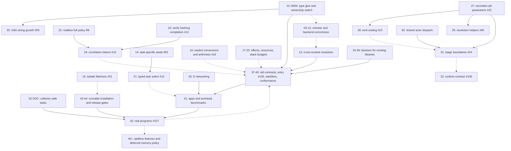

# Tuck work roadmap

Branch: `docs/verified-feature-status-2026-10-10`. Planning snapshot:
2026-10-10, compiler baseline `bab9828`.

This is the current execution order. It consolidates the dependency graph developed
in the Tuck work plan Project, the open GitHub issues, and the repository's missing
features. It replaces the execution queues in `ROADMAP.md` and `ROADMAP-GRAPH.md`,
not their historical rulings or design evidence. Recommendations below are proposals,
not new owner rulings.

## Working agreement

- **Finish fixes, then finish partial features.** A decision needed to finish an
  existing feature is taken immediately before that implementation, not postponed
  behind a general design freeze. New mechanisms come later.
- **Ownership fixes continue.** Finish the approved ownership rules. Backend
  collectors remain allowed; replacing them or adding a selectable memory-freeing
  policy is deferred.
- **Improve Nim, Odin and D together.** Each backend keeps its native runtime.
  Do not assume a shared C runtime is better without measurements.
- **Decide once, emit three times.** Record semantics and composition decisions
  in checking/lowering; emitters translate those decisions rather than rediscover them.
- **Ask before each implementation.** Present the current evidence, recommended
  scope, alternatives, dependencies and acceptance tests. Record the owner's answer
  here and in the relevant issue. No recommendation in this file authorizes code.
- **Stay on this branch.** Commit and push here; no new PR or branch unless requested.
- **One completed slice at a time.** Do not open another large feature while the
  current slice lacks tests, backend coverage, docs and an issue-status update.
- **Test-first, targeted iteration.** Write and demonstrate a failing test before
  implementation. During development run the relevant suites; reserve the full
  `tests/run` for the end-of-session gate.

## OWN implementation checkpoint

2026-10-10: the owner chose **finish glue G, then switch**. Work remains on this
branch. See [the detailed glue checkpoint](thoughts/shared/plans/2026-10-10-rule-g-status.md).

- The default ownership pass now elaborates the **common lowered AST before
  backend cloning**. It records consuming parameters and explicit copy, move,
  typed drop and reset nodes. Independent rule V gates emission.
- Odin emits recursive Glue operations at those sites. Strings, nested
  containers, recursive sums, generic parameters, task bodies, mailbox/select
  payloads, actor state, slabs and pools have focused allocation-tracked tests.
- Nim keeps native copy/destruction; D keeps its collector and recursive copy.
  D's tagged sums copy only the active payload. Legacy twins are absent from
  default emission; the old path is retained for differential tests.
- A39 and A41-A45 passed their default-mode probes and are now `bugFixed`.
  Focused ownership, value, memory-budget, task/message, slab/pool and generated
  backend suites pass. Common record reconstruction has all-backend checks for
  effects, evaluation order, lazy branches and repeated loop conditions.
  Any-depth singleton snapshots are tested with ordinary as well as tracked
  execution. The final full gate ran 56 suites: all 55 non-complexity suites
  passed; the explicitly deferred complexity ratchet is the sole failure,
  with unchanged thresholds. Eight unrelated known-bug pins remain open.
  See the detailed checkpoint for exact results. No unrelated roadmap item began.

## Evidence and limits

The GitHub snapshot contains 39 open issues, all linked in the ordered tables below.
An open issue is not proof that its original description is still accurate.
In particular, #12, #14, #31, #32 and #64 need reconciliation with later work or
rulings before acting on their original text.

Recent verification corrected stale markers in `LANGUAGE-OVERVIEW.md`,
`tuck-spec.md` and `MISSING-FEATURES.md`: generic `fnsig` declarations parse,
task-select examples run across backends, and several old checker failures are
already fixed. Do not recreate these as missing features.

Historical measurements and bug counts are not release gates. Reproduce each item
on the branch's current compiler before implementation. For items without an issue,
the IDs below are roadmap tracking IDs, not invented GitHub issue numbers.

## Dependency graph

Solid arrows are implementation prerequisites; dotted arrows express preferred
execution order or feedback. Independent tasks may be reordered by the owner.

The numbered tables are a suggested linear order consistent with these dependencies.
The graph deliberately retains independent paths: a local checker correction does
not technically require the ownership switch, and documentation-only work need not
wait for compiler implementation. The stdlib entry-point flag can be prototyped
before migration, but it should not trigger a parallel stdlib redesign now.

## Fixes to finish

| Order | Item | Prerequisites | Recommended direction and completion test |
|---|---|---|---|
| 01 | **OWN: approved ownership rules** | Existing ruled proposal, no new memory policy | Completed default common-AST switch and recursive Glue; A39/A41-A45 pins pass. Final full run: 55 non-complexity suites pass, only the owner-deferred complexity ratchet fails. See the [implementation and gate record](thoughts/shared/plans/2026-10-10-rule-g-status.md). Backend collectors remain. |
| 02 | **DGC: D collection inside a task** | A minimal reproduced crash | Add a known-bug pin first. Investigate supported coroutine-stack/root registration and collection scheduling in the current D runtime. Choose only after proving correctness across yield, resume and teardown. Keep GC; disabling it forever is not the fix. Require allocation-pressure tests that survive actual collections. |
| 03 | [#100: indexed writes through self](https://github.com/kobi2187/tuck/issues/100) | None | Classify `self.cells[i] = v` as mutation in shared analysis. Require `var` receivers and matching emitted receiver modes. Tests: nested paths, let/parameter refusal and successful mutation on three backends. |
| 04 | [#101: type name used as a value](https://github.com/kobi2187/tuck/issues/101) | Owner chooses construction semantics | Recommend rejection with `K {}` as the suggested fix, rather than implicit construction. Test fieldless and nonempty types; update doc-convert app after the ruling. |
| 05 | [#102: ambiguous variant ownership](https://github.com/kobi2187/tuck/issues/102) | Shared expected-type resolution | Resolve against the expected sum type and emit qualified variants. Refuse unresolved ambiguity. Cover match, transition checks, payloads and registry raises across backends. |
| 06 | [#103: arithmetic on records](https://github.com/kobi2187/tuck/issues/103) | Owner chooses coercion policy | Recommend rejecting record arithmetic and suggesting `.ms`, not implicit unwrapping. Fix downloader source accordingly. Test one-field and multi-field records against numeric operators. |
| 07 | [#30: volatile D registers](https://github.com/kobi2187/tuck/issues/30) | None | Use the supported D volatile load/store primitives. Check optimized output and generated accessors, not only unoptimized execution. |
| 08 | [#16: conversion correctness slice](https://github.com/kobi2187/tuck/issues/16) | Review existing numeric ruling | Stop accepting implicit cross-type conversions; pin current overflow/backend mismatches. Keep this slice separate from the cast syntax and arithmetic-policy decision at 16. |
| 09 | [#62: unresolved constant dimensions](https://github.com/kobi2187/tuck/issues/62) | None | If an array size cannot be evaluated, report that instead of skipping the length check. Full pure-function const evaluation is a later slice at 36. |
| 10 | [#33: ignored stack annotation](https://github.com/kobi2187/tuck/issues/33) | Owner chooses interim behavior | Recommend a clear unsupported-feature error for `[stack: N]` until a sound check exists; do not accept a false safety promise. Full implementation is at 20. |
| 11 | [#65: discarded I/O kinds](https://github.com/kobi2187/tuck/issues/65) | Owner chooses interim behavior | Reject unsupported kinded forms while retaining plain `[io]`. Preserve the kind in the AST before implementing its semantics at 18. |
| 12 | [#71: extern effect trust](https://github.com/kobi2187/tuck/issues/71) | None | Document declared extern effects as a trusted boundary, not protection against a malicious or incorrect foreign implementation. Keep FFI tests separate from the static effect claim. |
| 13 | [#73: imported actors](https://github.com/kobi2187/tuck/issues/73) and **R11/GB: cross-module providers** | Shared declaration/module resolution | Finish imported actor checks; re-run the full cross-module pins and group-bound provider case. Use resolved declaration identity, not the current module or emitter name guessing. Do not reopen the already-fixed const half without a repro. |
| 14 | [#55: timeout latency](https://github.com/kobi2187/tuck/issues/55) | Task completion identity | Await the requested task, not global scheduler quiescence. Separately specify cleanup of losing subscriptions and lifetime of unrelated work. Require elapsed-time and unrelated-task tests on three backends. |
| 15 | [#31: intermittent Odin failure](https://github.com/kobi2187/tuck/issues/31) and **FLK: runner/invariant flakiness** | Reproduction or useful diagnostics | Pin toolchain versions, preserve stderr/exit status and isolate test output directories. Do not patch an unobserved compiler cause. Close only on explicit evidence agreed with the owner. |

## Complete partial language and runtime features

| Order | Item | Prerequisites | Recommended direction and completion test |
|---|---|---|---|
| 16 | [#16: casts and arithmetic policy](https://github.com/kobi2187/tuck/issues/16) | 08 | Ask about `~`, `^` and any word alias; implement explicit casts. Make wrapping/trapping modes real before choosing the bare-primitive default, as the issue specifies. Match boundary-value behavior across backends. Defer advanced narrowing reports if needed. |
| 17 | [#14: effect propagation](https://github.com/kobi2187/tuck/issues/14) | Reconcile conflicting issue text and later rulings | Ask whether effects remain declared or are inferred. Recommend preserving declared public contracts with precise missing-effect diagnostics unless the owner confirms inference. Do not silently reinterpret the existing issue. |
| 18 | [#64: allocation/IRQ effects](https://github.com/kobi2187/tuck/issues/64), [#65: I/O kinds](https://github.com/kobi2187/tuck/issues/65) | 11; shared allocation facts from OWN | Complete `[no_alloc]` using lowered operations, including implicit copies; validate IRQ restrictions. The `may_block` conflict is already checked in the recent probe. Ask whether I/O kinds are closed or extensible, then implement retained kind sets. |
| 19 | [#32: resource completion tracking](https://github.com/kobi2187/tuck/issues/32) | Existing resource implementation | Revalidate the remaining acquire-must-finish/report gaps. Ask about path-sensitive finish policy; preserve existing registry policies. Test early return, errors, double finish and outstanding resources. This is not memory-GC replacement. |
| 20 | [#33: real stack budgets](https://github.com/kobi2187/tuck/issues/33) | 10; target layout/call graph facts | Decide whether target compiler/post-link evidence is required for byte-accurate claims. Reject unknown or recursive paths rather than guessing. Keep different backend frame layouts explicit. |
| 21 | [#15: typed task select](https://github.com/kobi2187/tuck/issues/15) and **R10: arm shape** | 14; arm-shape ruling | Use typed sources instead of opaque dotted strings. Ask whether task arms retain blocks/early returns. Make example 16 coherent and run-gated; existing examples 29/30 are not missing features. |
| 22 | **R6: mailbox-full policies** | Existing ruled policy in ROADMAP.md | Audit and finish `drop`, `wait`, `assert`, default wait and self-send behavior on supported actor modes/backends. These are already ruled, not a new policy debate. |
| 23 | [#12: hashing completion audit](https://github.com/kobi2187/tuck/issues/12) | Existing group Hashable implementation | Verify map/set requirements, primitive-key coverage and collision handling. Recommend closing or narrowing the stale issue if its original blocker is gone; do not rewrite hashing just because it is open. |
| 24 | [#10: correlation tokens](https://github.com/kobi2187/tuck/issues/10) | 22, 23 | Keep tokens ordinary caller-generated payload values. Ask about token lifecycle, duplicate replies, cancellation and reply-full behavior. Prefer a library abstraction over new codegen if feasible. |
| 25 | [#93: Odin string growth](https://github.com/kobi2187/tuck/issues/93) | 01 | Use an owned growable representation/builder where analysis proves it safe. Preserve value semantics and foreign string boundaries. Require time scaling and memory tests, not just correct output. |
| 26 | **NET: D networking and backend speed parity** | Existing runtime API; 02 for task allocation safety | Finish D listen/accept/connect and the example-42 build gap. Keep DNS support and blocking-worker concurrency separate decisions. Benchmark the same workload per backend before choosing an optimization. |

## Finish shared compiler decisions

These fixes support the partial features above. Pull a narrowly required prerequisite
forward if a real feature cannot finish without it; do not turn them into a compiler rewrite.

| Order | Item | Prerequisites | Recommended direction and completion test |
|---|---|---|---|
| 27 | [#22: recorded call parameters](https://github.com/kobi2187/tuck/issues/22) | Shared resolution | Record parameters for pending functions, distinct constructors and combinators; delete remaining fallbacks only when every call is covered. |
| 28 | [#23: emit scaling](https://github.com/kobi2187/tuck/issues/23) | 27 preferred, not a blocker to profiling | Reprofile stage costs on current code. Fix the measured hotspot; do not assume historical scaling or which backend causes it. Compare multiple input sizes. |
| 29 | [#60: name matching](https://github.com/kobi2187/tuck/issues/60) | 27 for resolved call facts | Centralize matching/resolved identity. Replace the known duplicated sites with focused tests. |
| 30 | **M4.3: actor dispatch lowering** | Message envelope represented in shared IR | Lower envelope/dispatch decisions once; preserve handler order, mailbox and field ownership. Differential-check emitted programs. |
| 31 | [#24: stage boundaries](https://github.com/kobi2187/tuck/issues/24) | 27, 30; measurements from 28 | Agree the indexing/semantic-fact boundary and add stage verification. Document pre/postconditions, including effects after typecheck and lowering recursion order. |
| 32 | [#106: runtime contract](https://github.com/kobi2187/tuck/issues/106) and **R12: diagnostic codes** | Existing runtime APIs; 31 for broader composition cleanup | First write the actual runtime operations and shared behavioral tests. Move composition decisions incrementally. Add codes/explanations for uncovered rules. No mandatory shared C implementation. |

## Resolve blockers for existing libraries

| Order | Item | Prerequisites | Recommended direction and completion test |
|---|---|---|---|
| 33 | [#57: expressions and local setup](https://github.com/kobi2187/tuck/issues/57) | 21 for select-arm consistency | Ask about the smallest fix for existing apps. Recommend fixing common-case payload/cell setup without implicit captures; do not introduce escaped environment-carrying blocks contrary to the owner's no-capture design. |
| 34 | [#17: variant-set spelling](https://github.com/kobi2187/tuck/issues/17), [#11: recursive records](https://github.com/kobi2187/tuck/issues/11) | Current sums/slabs audit | Choose spelling for the already-ruled variant sets. For #11, distinguish recursive sums already supported from direct infinite-sized records; decide whether slab handles satisfy the actual use cases. |
| 35 | **SLABGEN: generic slab algorithms** | 01, 13; ruling on existing proposal | Review [Q1-Q6](thoughts/shared/plans/2026-10-04-generic-slabs-proposal.md). Recommend type-indexed slabs with inference from typed handles, lowering into ordinary slab operations. Re-test generic instantiation and owner confinement. |
| 36 | **F3: fallible pure functions** and [#62: pure const evaluation](https://github.com/kobi2187/tuck/issues/62) | 09, 17 | Separate error return from I/O if confirmed by the owner; then implement bounded compile-time evaluation with explicit unsupported/termination diagnostics. Do not make unknown constants silently valid. |

## Stdlib and practical use

| Order | Item | Prerequisites | Recommended direction and completion test |
|---|---|---|---|
| 37 | **C0: standard contracts** | 13, 33-36 where contracts need them | Review/migrate v2 group contracts. Absorb temporary std support gradually rather than delete working primitives first. Keep managers above the groups, later. |
| 38 | [#105: stdlib entry point](https://github.com/kobi2187/tuck/issues/105) | Contract/import-path ruling | Ask about search paths/default entry, then implement `--stdlib:NAME` and `STDLIB`. Two entries must replace one group's provider while retaining the rest unchanged, on three backends. |
| 39 | **C2/ST7: blessed satisfiers and weekend kit** | 23, 26, 37, 38 | Mix shim, FFI and pure Tuck per group. Fill actual gaps in map/set, sort, JSON/serde, formatting, random, time and file I/O. Reuse working functionality rather than treating every module as absent. |
| 40 | **C3/C4: conformance and comparison** | 39 | One behavior suite reusable by blessed and community satisfiers; benchmarks by implementation/backend for time and peak memory. Performance thresholds need an owner decision, not an invented universal cutoff. |
| 41 | **ST4-ST6: apps coverage** | 03-06, 21, 33, 39 | Repair apps that fail checking/building; stage output per backend; run programs with entry points. Add mocks only when real external effects prevent reliable tests. Reference the [apps index](stdlib-project/INDEX.md). |
| 42 | [#107: real programs](https://github.com/kobi2187/tuck/issues/107) | Usable stdlib slices, not every catalogue module | Choose useful workloads with the owner. The proposed line counts are a scale target, not a quality gate. Feed friction back into correctness and partial-feature work immediately. |
| 43 | **TOOLS: install, run, version, holes** | Runtime packaging for run/install | Revalidate `--version`, relocatable runtime and `tuck run` gaps, then complete the small coherent workflow. Make unsupported capability pins visible; do not assume these commands are absent without checking. |
| 44 | **RELEASE: gates and stability** | Correctness, runnable workloads, 40-43 | Define achievable 1.0 gates with the owner: portable behavior, supported corpus, honest capabilities, documentation and stability/deprecation policy. Do not freeze the old milestone graph as a promise. |

## Later or explicitly deferred

Every open issue remains visible here even when not on the immediate critical path.
None of these is silently closed or treated as already authorized.

| Order | Item | Dependency or trigger | Recommended path |
|---|---|---|---|
| 45 | [#63: stable effect manifest](https://github.com/kobi2187/tuck/issues/63), [#67: actor isolation report](https://github.com/kobi2187/tuck/issues/67) | 17-18; 13 for imported actor facts | Emit stable checked summaries. Pull forward only if needed to test the effects work; do not make a new report block existing correctness fixes. |
| 46 | [#66: resource contention graph](https://github.com/kobi2187/tuck/issues/66) | 19 | Start with conservative acquire-order diagnostics; do not promise runtime deadlock freedom from a static approximation. |
| 47 | [#70: mock generation](https://github.com/kobi2187/tuck/issues/70), [#68: generated properties](https://github.com/kobi2187/tuck/issues/68) | Trusted resolved extern/effect sets and a usable test runner | First hand-write fixtures needed by current apps. Generate only after the reachable surface and preconditions are sound. |
| 48 | [#69: opt-in memoization](https://github.com/kobi2187/tuck/issues/69) | Reliable purity and bounded cache policy | Require explicit opt-in, checked effect freedom and measurements. It is new capability, not a partial-feature blocker. |
| 49 | [#74: actor heartbeat channel](https://github.com/kobi2187/tuck/issues/74) | 24; liveness semantics ruling | Define stuck versus slow and scheduling guarantees before adding a priority channel. |
| 50 | [#91: binary parsing/declaration syntax](https://github.com/kobi2187/tuck/issues/91) | Workload demonstrating need | Prefer reuse of the register bit/layout concepts; test endian, bounds and truncation rules in a small proposal first. |
| 51 | [#104: memory/layout questions](https://github.com/kobi2187/tuck/issues/104) | Explicit owner request to revisit | GC replacement and selectable freeing policy are deferred. Ordinary layout/FFI ABI and D argument passing can be addressed narrowly if a current bug requires them; no unmeasured zero-copy promise. |
| 52 | **EMBED: bare-metal profile** | A selected real board/HAL workload | Scope DMA/region ownership, bounded strings/collections, stack evidence and coroutine representation through a concrete spike. No actor-instance redesign: actors are singleton services; tasks supply independent units. |
| 53 | **ECOSYSTEM: tooling and managers** | Real workload evidence | Formatter/LSP/debug mapping and package distribution are later decisions. Package manager remains undecided. Managers/actor-based managers layer on groups; no mandatory closure captures, derive mechanism or global registry. |

## Missing-feature reconciliation

These entries cover repository gaps that otherwise disappear because no open issue
names them. Historical reports remain evidence, not authoritative live status.

| Repository reference | Current roadmap home |
|---|---|
| `MISSING-FEATURES.md` §A ownership pins | 01 OWN |
| §A imported interfaces/mixins/actors/group providers/registry raises | 13 R11/GB; #73 |
| §A timeout and other remaining behavioral pins | 14 #55; audit remaining pins during 01/13 rather than carry a stale count |
| §B broken example 16 | 21 #15; current first error and intended source semantics both need attention |
| §C DNS, blocking-worker pool, stdin reactor path | 26 NET, after basic D parity; independent optional improvements, not hidden prerequisites |
| §C missing D networking/runtime speed parity | 26 NET |
| §C one C runtime suggestion | Superseded: native runtimes and shared contracts (32 #106); compare before choosing shared code |
| §D emission-only library builds | 41 and 43; do not claim a successful emission is a successful host build |
| §D dead tokens and postfix precedence diagnostics | Small hygiene under 29/32; confirm before deletion or grammar changes |
| §D effects and `[may_block]` | 17/18; the historical claim that `may_block` has no checker meaning is already corrected |
| §E fixed items | Regression tests only, not a new backlog |
| §F transient child-output errors, package-directory collisions | 15 FLK and 41 isolated staging |
| §F mailbox-lock cost/thread namespace collisions | 26 runtime measurements and 29 resolution; preserve safety when optimizing |
| §F gate-list coverage limitations | 40/41; behavioral gates for every claimed capability |
| `ROADMAP.md` M4.3, R6, R10, R11, R12 | 30, 22, 21, 13, 32 respectively |
| `ROADMAP.md` M2.1/provenance cleanup | Reconcile with OWN's superseding rules; do not implement both architectures in parallel |
| `ROADMAP-GRAPH.md` F1/F4/F26 | Parser generic-fnsig and unknown-name gaps have later fixes; interface values are copying variants. Revalidate actual remaining cases, not the obsolete alternatives |
| `ROADMAP-GRAPH.md` F2/F3/F5 | Derive deferred (53); pure fallibility at 36; DMA/region spike at 52 |
| `ROADMAP-GRAPH.md` actor instances / backend split | Superseded by singleton services plus tasks and tandem backends |
| `stdlib-project/v2`, `FRICTIONS.md`, `modules/`, `apps/` | 33-42; contracts plus mixed satisfiers, not three all-or-nothing library replacements |

## Decision queue and progress

Start with **01 OWN**. The ownership proposal is already ruled; the question is
whether to finish its existing migration plan unchanged or first take a smaller
bug-fix slice. Recommended: finish the approved glue/switch sequence while retaining
native backend memory management.

For every item, record:

1. **Evidence:** current repro/tests and what is already implemented.
2. **Decision:** owner's selected scope and alternatives declined.
3. **Implementation:** shared semantic change, backend adaptation, tests and docs.
4. **Verification:** behavior on Nim/Odin/D and relevant time/memory tests.
5. **Completion:** commit, issue update, remaining limitations and next ready item.

| Item | State | Owner decision | Commit |
|---|---|---|---|
| Roadmap | Published on this branch | Requested 2026-10-10 | See branch history |
| 01 OWN | Waiting for implementation-scope approval | Keep backend collectors; finish fixes. Proposed migration sequence awaits confirmation | Not started in this workstream |

If an implementation reveals a new prerequisite, amend the graph and ask before
expanding scope. Do not silently convert a bug fix into a new language mechanism.
